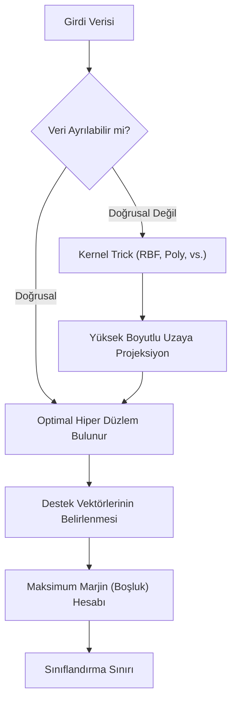

## 📌 Özet
Destek Vektör Makineleri (SVM), iki sınıf arasındaki boşluğu (margin) en üst düzeye çıkaran 'optimal hiper düzlemi' bularak sınıflandırma ve regresyon yapan güçlü bir gözetimli öğrenme algoritmasıdır. Algoritmanın temel gücü, düşük boyutlu uzayda doğrusal olarak ayrılması imkansız olan verileri 'Kernel Trick' yöntemiyle daha yüksek boyutlu bir uzaya taşıyarak orada ayrıştırabilmesidir. SVM, özellikle yüksek boyutlu verilerde ve sınıfların net bir şekilde ayrıldığı durumlarda çok başarılı sonuçlar verirken, eğitim verisindeki gürültüye ve özelliklerin ölçeklendirilmesine karşı oldukça hassastır. Bu nedenle, SVM uygulanmadan önce verilerin standartlaştırılması model performansı için hayati önem taşır.

## 🧠 Detay

### SVM Çalışma Mantığı ve Karar Mekanizması


### Temel Kavramlar
```
Destek Vektörleri → Hiper düzleme en yakın noktalar
Marj → İki sınıf arasındaki mesafe
C → Marj ile hata dengesi
Kernel → Doğrusal olmayan dönüşüm
```

### SVM Sınıflandırma
```python
from sklearn.svm import SVC
from sklearn.preprocessing import StandardScaler
from sklearn.pipeline import Pipeline

# SVM ölçeklemeye duyarlı → StandardScaler zorunlu
pipe = Pipeline([
    ("scaler", StandardScaler()),
    ("svm", SVC(
        C=1.0,
        kernel="rbf",      # radial basis function
        gamma="scale",
        probability=True,  # predict_proba için
        random_state=42
    ))
])

pipe.fit(X_train, y_train)
y_pred = pipe.predict(X_test)
```

### Kernel Türleri
```python
# Lineer kernel
SVC(kernel="linear", C=1.0)

# RBF (en çok kullanılan)
SVC(kernel="rbf", C=1.0, gamma="scale")

# Polinom
SVC(kernel="poly", degree=3, C=1.0)
```

### SVM Regresyon
```python
from sklearn.svm import SVR

svr = Pipeline([
    ("scaler", StandardScaler()),
    ("svr", SVR(kernel="rbf", C=100, epsilon=0.1))
])
svr.fit(X_train, y_train)
```

### C ve gamma Etkisi
```python
# C küçük → geniş marj, daha fazla hata (underfitting riski)
# C büyük → dar marj, az hata (overfitting riski)
# gamma küçük → geniş etki alanı
# gamma büyük → dar etki alanı (overfitting riski)

from sklearn.model_selection import GridSearchCV

parametreler = {
    "svm__C": [0.1, 1, 10, 100],
    "svm__gamma": ["scale", "auto", 0.001, 0.01]
}
gs = GridSearchCV(pipe, parametreler, cv=5)
gs.fit(X_train, y_train)
print(gs.best_params_)
```

## 💡 Bağlantılar
- [[ML - Model Değerlendirme Metrikleri]]
- [[ML - Hiperparametre Optimizasyonu]]
- [[DS - Veri Dönüşümleri]]

## ❓ Sorular / Anlamadıklarım
- Kernel trick tam olarak nasıl çalışır?
- SVM ne zaman Random Forest'tan daha iyi?

## 🔗 Kaynaklar
- https://scikit-learn.org/stable/modules/svm.html
