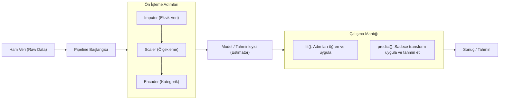

## 📌 Özet
Makine öğrenmesi süreçlerinde 'Pipeline', veri ön işleme adımları ile model tahminleme aşamasını tek bir yapısal nesne altında birleştiren güçlü bir araçtır. Pipeline kullanmanın en kritik avantajı, 'Veri Sızıntısını' (Data Leakage) önleyerek, ön işleme adımlarının (ölçeklendirme, eksik veri tamamlama vb.) sadece eğitim verisine göre öğrenilmesini ve test verisine hatasız uygulanmasını garanti altına almasıdır. Bu yaklaşım hem kodun daha temiz, modüler ve okunabilir olmasını sağlar hem de üretim (production) aşamasında modelin deploy edilmesini son derece kolaylaştırır. Ayrıca, GridSearchCV gibi hiperparametre optimizasyon süreçlerinde tüm iş akışının çapraz doğrulama (cross-validation) katmanları içinde tutarlı bir şekilde koşturulmasına olanak tanır.

## 🧠 Detay

### Pipeline Veri Akış Şeması


### Neden Pipeline?
```python
# ❌ Yanlış — veri sızıntısı riski
scaler.fit(X)                    # tüm veriyle fit
X_scaled = scaler.transform(X)
X_train, X_test = train_test_split(X_scaled)

# ✅ Doğru — sadece eğitim verisiyle fit
X_train, X_test = train_test_split(X)
scaler.fit(X_train)              # sadece train
X_train_s = scaler.transform(X_train)
X_test_s = scaler.transform(X_test)
```

### Temel Pipeline
```python
from sklearn.pipeline import Pipeline
from sklearn.preprocessing import StandardScaler
from sklearn.linear_model import LogisticRegression

pipe = Pipeline([
    ("scaler", StandardScaler()),
    ("model", LogisticRegression())
])

pipe.fit(X_train, y_train)
tahmin = pipe.predict(X_test)
skor = pipe.score(X_test, y_test)
```

### ColumnTransformer ile Karma Veri
```python
from sklearn.compose import ColumnTransformer
from sklearn.preprocessing import StandardScaler, OneHotEncoder
from sklearn.impute import SimpleImputer

sayisal = ["yas", "gelir", "puan"]
kategorik = ["sehir", "meslek"]

on_isleyici = ColumnTransformer([
    ("sayisal", Pipeline([
        ("imputer", SimpleImputer(strategy="median")),
        ("scaler", StandardScaler())
    ]), sayisal),
    ("kategorik", Pipeline([
        ("imputer", SimpleImputer(strategy="most_frequent")),
        ("encoder", OneHotEncoder(handle_unknown="ignore"))
    ]), kategorik)
])

pipe = Pipeline([
    ("on_isleme", on_isleyici),
    ("model", LogisticRegression())
])
```

### Pipeline ile Cross Validation
```python
from sklearn.model_selection import cross_val_score

skorlar = cross_val_score(pipe, X, y, cv=5, scoring="accuracy")
print(f"Ortalama: {skorlar.mean():.3f} ± {skorlar.std():.3f}")
```

### Pipeline ile GridSearch
```python
from sklearn.model_selection import GridSearchCV

parametreler = {
    "model__C": [0.01, 0.1, 1, 10],
    "model__max_iter": [100, 200]
}

gs = GridSearchCV(pipe, parametreler, cv=5)
gs.fit(X_train, y_train)
print(gs.best_params_)
```

## 💡 Bağlantılar
- [[ML - Makine Öğrenmesine Giriş]]
- [[ML - Eğitim Test Ayrımı ve Cross Validation]]
- [[ML - Hiperparametre Optimizasyonu]]
- [[DS - Veri Dönüşümleri]]

## ❓ Sorular / Anlamadıklarım
- Veri sızıntısı (data leakage) neden bu kadar tehlikeli?
- fit_transform sadece train'de mi kullanılmalı?

## 🔗 Kaynaklar
- https://scikit-learn.org/stable/modules/compose.html
