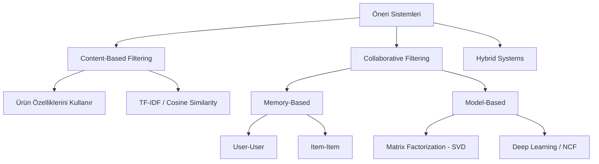

## 📌 Özet
Öneri sistemleri, kullanıcılara ilgilerini çekebilecek öğeleri (film, ürün, müzik) tahmin eden algoritmalardır. İki ana yaklaşım vardır: İçerik Tabanlı (Content-Based) ve İşbirlikçi Filtreleme (Collaborative Filtering).

---

## 🧠 Detay

### 🗺️ Öneri Sistemleri Türleri

### 1. İçerik Tabanlı Filtreleme (Content-Based)
"Bunu beğendiyseniz, buna benzer şu ürünü de sevebilirsiniz." mantığıyla çalışır.
- **Yöntem:** Ürün açıklamaları üzerinden benzerlik (Cosine Similarity).
- **Avantaj:** "Cold Start" (yeni ürün) sorunu yaşamaz.
- **Dezavantaj:** Kullanıcının ilgi alanı dışına çıkamaz.

### 2. İşbirlikçi Filtreleme (Collaborative Filtering)
"Sizin gibi kullanıcılar bunu da beğendi." mantığıyla çalışır.
- **User-User:** Benzer kullanıcıların beğendiği ürünleri önerir.
- **Item-Item:** Aynı kullanıcılar tarafından beğenilen ürünlerin benzerliğini hesaplar (genellikle daha kararlıdır).
- **Matrix Factorization (SVD):** Kullanıcı-Ürün matrisini iki düşük boyutlu matrise ayırır (Latent Factors).

### 3. Hibrit Sistemler (Hybrid)
İki yöntemi birleştirerek dezavantajları minimize eder (Örn: Netflix).

### Cold Start Problemi
Yeni bir kullanıcı veya yeni bir ürün sisteme girdiğinde eldeki verinin yetersiz olması durumudur.
- **Çözüm:** Popüler ürünleri göstermek veya kayıt sırasında ilgi alanlarını sormak.

---

## 💡 Bağlantılar
- [[FE - Metin Özellikleri]]
- [[ML - K-Nearest Neighbors]]
- [[ML - PCA - Boyut İndirgeme]]

## ❓ Sorular / Anlamadıklarım
- Öneri sistemleri nasıl test edilir? (Precision@K, Recall@K, NDCG metrikleri kullanılır).

## 🔗 Kaynaklar
- Recommender Systems Handbook
- Surprise Library (Python)
