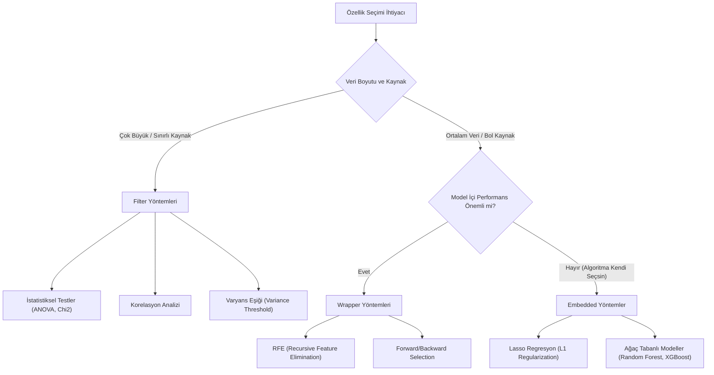

## 📌 Özet
Özellik seçimi (Feature Selection), makine öğrenmesi modelinin performansını doğrudan etkileyen en kritik adımlardan biridir. Bu işlem, hedef değişkeni tahmin etmede en yüksek bilgiye sahip özellikleri seçerek gereksiz, gürültülü veya fazla korele olan özellikleri eler. Bu sayede model karmaşıklığı düşer, overfitting (aşırı öğrenme) riski azalır ve hem eğitim hem de tahmin süreci ciddi oranda hızlanır.

## 🧠 Detay

### 🗺️ Özellik Seçimi Yöntemleri



### Filter Yöntemleri (Model Bağımsız)
```python
from sklearn.feature_selection import SelectKBest, f_classif, chi2
import pandas as pd

# ANOVA F-testi
selector = SelectKBest(score_func=f_classif, k=10)
X_secilmis = selector.fit_transform(X_train, y_train)

# Hangi özellikler seçildi?
secilen = X.columns[selector.get_support()]
print(secilen)

# Korelasyon ile seçim
korelasyon = df.corr()["hedef"].abs().sort_values(ascending=False)
print(korelasyon)
```

### Wrapper Yöntemleri (Model Bazlı)
```python
from sklearn.feature_selection import RFE
from sklearn.linear_model import LogisticRegression

# Recursive Feature Elimination
rfe = RFE(
    estimator=LogisticRegression(max_iter=1000),
    n_features_to_select=10,
    step=1
)
rfe.fit(X_train, y_train)

secilen = X.columns[rfe.support_]
siralama = pd.Series(rfe.ranking_, index=X.columns)
```

### Embedded Yöntemler (Model İçi)
```python
from sklearn.feature_selection import SelectFromModel
from sklearn.ensemble import RandomForestClassifier

# Random Forest özellik önemi
rf = RandomForestClassifier(n_estimators=100, random_state=42)
rf.fit(X_train, y_train)

selector = SelectFromModel(rf, threshold="median")
X_secilmis = selector.fit_transform(X_train, y_train)

# Lasso ile seçim
from sklearn.linear_model import LassoCV
lasso = LassoCV(cv=5)
selector_lasso = SelectFromModel(lasso)
selector_lasso.fit(X_train, y_train)
```

### Varyans Eşiği
```python
from sklearn.feature_selection import VarianceThreshold

# %0 varyansı olan (sabit) özellikleri kaldır
vt = VarianceThreshold(threshold=0.0)
X_temiz = vt.fit_transform(X)
```

### Özellik Önemi Görselleştirme
```python
import matplotlib.pyplot as plt

onem = pd.DataFrame({
    "Özellik": X.columns,
    "Önem": rf.feature_importances_
}).sort_values("Önem", ascending=True)

plt.figure(figsize=(10, 8))
plt.barh(onem["Özellik"], onem["Önem"])
plt.title("Özellik Önemi")
plt.show()
```

## 💡 Bağlantılar
- [[DS - Korelasyon Analizi]]
- [[ML - PCA - Boyut İndirgeme]]
- [[ML - Random Forest]]

## ❓ Sorular / Anlamadıklarım
- Filter, wrapper ve embedded arasında ne zaman hangisi tercih edilir?
- Çok fazla özellik modeli her zaman kötüleştirir mi?

## 🔗 Kaynaklar
- https://scikit-learn.org/stable/modules/feature_selection.html
