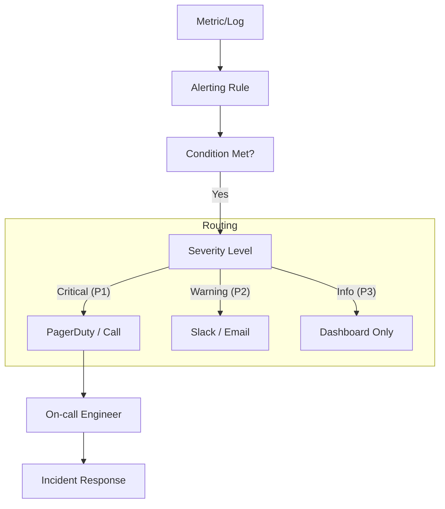

## 📌 Özet
Alerting (Uyarı mekanizması), bir sistemde anomali oluştuğunda ilgili kişileri haberdar etme sürecidir. Ancak kontrolsüz uyarılar "Alert Fatigue" (Uyarı Yorgunluğu) yaratarak gerçek krizlerin gözden kaçmasına neden olabilir. Etkili bir alerting stratejisi, sadece "aksiyon alınabilir" (actionable) durumlar için uyarı üretmelidir. On-call yönetimi ise, bu uyarılara müdahale edecek ekiplerin rotasyonunu ve olay müdahale (incident response) süreçlerini kapsar. Bu notta, uyarı yorgunluğunu önleme yöntemlerini ve SRE tabanlı alerting yaklaşımlarını inceleyeceğiz.

## 🧠 Detay



### 1. Alerting Türleri
- **Symptom-based Alerting:** Kullanıcıyı etkileyen belirtiler üzerinden uyarı kurun. (Örn: "Hata oranı %5'i geçti") - **Tercih edilen.**
- **Cause-based Alerting:** Sorunun nedenine odaklanan uyarıdır. (Örn: "CPU %90") - Çok fazla noise yaratabilir.

### 2. Alert Fatigue'den Kaçınma
- **Actionability:** Eğer uyarının sonunda bir insan bir şey yapmayacaksa, o uyarı kurulmamalıdır.
- **Threshold Tuning:** Eşik değerlerini dinamik tutun veya outlier tespiti kullanın.
- **Grouping/Inhibition:** Birbirine bağlı sistemlerde (örn: DB çöktüğünde 50 servisin hata vermesi) sadece ana kaynağın uyarısını gönderin.

### 3. On-call Kültürü
- **Rotation:** Adil bir nöbet listesi oluşturulmalıdır.
- **Documentation (Runbooks):** Her uyarının bir runbook linki olmalıdır. Müdahale eden mühendis "şimdi ne yapmalıyım?" sorusuna anında yanıt bulabilmelidir.
- **Compensation:** On-call olan mühendisler zaman veya maddi olarak ödüllendirilmelidir.

### Örnek Prometheus Alert Rule
```yaml
groups:
- name: APIAlerts
  rules:
  - alert: HighErrorRate
    expr: job:request_errors:rate5m > 0.05
    for: 10m
    labels:
      severity: critical
    annotations:
      summary: "High error rate on {{ $labels.instance }}"
      description: "Error rate is above 5% for 10 minutes."
      runbook_url: "https://wiki.company.com/runbooks/high-error-rate"
```

### SRE Best Practices
- **SLO-based Alerting:** Sadece SLO'yu tehdit eden (burn rate yüksek olan) durumlar için telefonla uyarı (page) gönderin.
- **Post-mortem:** Her P1 olayından sonra bir analiz yapın ve uyarının neden geç veya erken geldiğini sorgulayın.

## 💡 Bağlantılar
- [[MO - SRE Prensipleri ve Hata Bütçesi (SLI, SLO)]]
- [[MO - Prometheus ile Metrik Toplama]]
