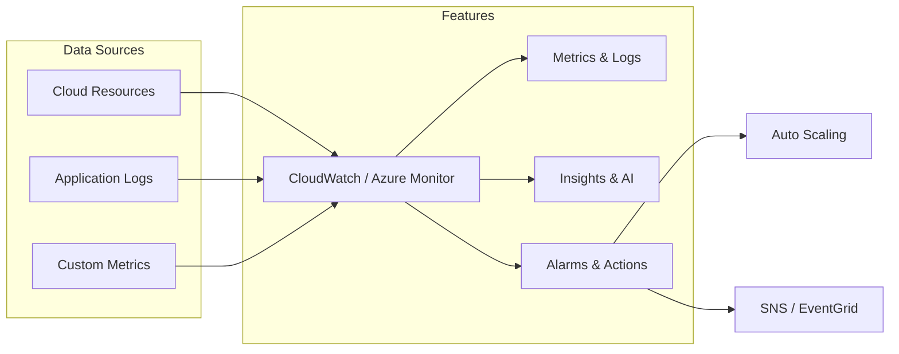

## 📌 Özet
Bulut sağlayıcıları, kendi platformları için optimize edilmiş, yönetilen (managed) monitoring servisleri sunar. AWS için CloudWatch ve Azure için Azure Monitor, altyapıdan uygulama seviyesine kadar geniş bir yelpazede veri toplar. Bu servislerin en büyük avantajı, bulut kaynaklarıyla (EC2, Lambda, S3, AKS) derin entegrasyona sahip olmaları ve kurulum gerektirmemeleridir. Ancak, multi-cloud stratejilerinde vendor lock-in riskine ve yüksek maliyetlere dikkat edilmelidir. Bu notta, her iki servisin yeteneklerini ve maliyet optimizasyon stratejilerini inceleyeceğiz.

## 🧠 Detay



### 1. AWS CloudWatch
- **CloudWatch Metrics:** AWS servislerinden gelen standart metrikler.
- **CloudWatch Logs:** Log verilerini saklar ve `Logs Insights` ile SQL benzeri sorgulara imkan tanır.
- **Alarms:** Metrikler eşiği geçtiğinde aksiyon (Auto Scaling tetikleme, SNS mesajı) başlatır.
- **Synthetics:** Web sitenizin durumunu kontrol eden "canary" scriptleri çalıştırır.

### 2. Azure Monitor
- **Application Insights:** Uygulama performans yönetimi (APM). Request, exception ve dependency takibi yapar.
- **Log Analytics:** Kusto Query Language (KQL) kullanarak büyük ölçekli log analizi sağlar.
- **Metrics Explorer:** Altyapı metriklerini görselleştirmek için kullanılır.
- **Workbooks:** Özelleştirilebilir, etkileşimli raporlar ve dashboardlar sunar.

### KQL Örneği (Azure Monitor)
Son 1 saatteki hatalı isteklerin analizi:
```kusto
AppRequests
| where TimeGenerated > ago(1h)
| where Success == false
| summarize count() by Name, ResultCode
| order by count_ desc
```

### 3. Maliyet Yönetimi
Bulut monitoring servisleri "pay-as-you-go" modeliyle çalışır ve veri hacmi arttıkça çok pahalı hale gelebilir.
- **Sampling:** Log ve metrik toplama sıklığını optimize edin.
- **Retention:** Log saklama sürelerini ihtiyaca göre ayarlayın (örn: prod için 30 gün, dev için 7 gün).
- **Log Levels:** Sadece ERROR ve WARNING seviyesindeki logları buluta gönderip, DEBUG loglarını yerelde bırakın.

### SRE Best Practices
- **Infrastructure as Code:** Monitoring yapılandırmanızı (Alarmlar, Dashboardlar) Terraform veya CloudFormation ile yönetin.
- **Unified View:** Mümkünse bulut metriklerini Grafana gibi merkezi bir araçta toplayarak hibrit bir görünüm elde edin.

## 💡 Bağlantılar
- [[MO - Grafana ile Görselleştirme ve Dashboard]]
- [[MO - Giriş: Monitoring vs Observability (Three Pillars)]]
