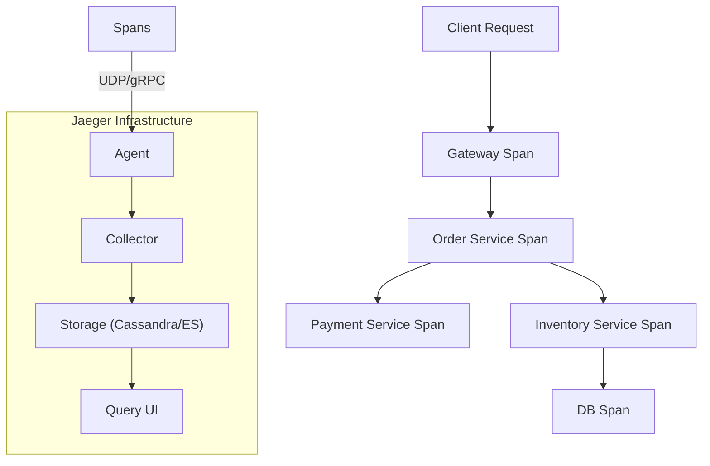

## 📌 Özet
Distributed Tracing (Dağıtık İzleme), bir isteğin mikroservis mimarisi içindeki tüm yolculuğunu uçtan uca takip etmemizi sağlayan bir observability yöntemidir. Monolitik yapılarda stack trace yeterli olurken, mikroservislerde bir hata birden fazla servis arasındaki iletişimden kaynaklanabilir. Jaeger, Uber tarafından geliştirilen ve CNCF projesi olan popüler bir tracing aracıdır. Trace'ler, "Span" adı verilen küçük işlem birimlerinden oluşur ve sistemdeki gecikme (latency) darboğazlarını bulmak için eşsizdir. Bu notta, tracing mimarisini ve OpenTelemetry standartlarını ele alacağız.

## 🧠 Detay



### 1. Temel Kavramlar
- **Trace:** Bir isteğin sistemdeki tüm yolculuğunu temsil eden veri bütünüdür.
- **Span:** Bir trace içindeki tek bir mantıksal işlem birimidir (örn: HTTP isteği, DB sorgusu).
- **Context Propagation:** `TraceID` ve `SpanID`'nin servisler arasında HTTP header'ları (örn: `B3`, `W3C TraceContext`) aracılığıyla taşınmasıdır.

### 2. Jaeger Mimarisi
- **Jaeger Client:** Uygulama koduna gömülü kütüphane.
- **Jaeger Agent:** Localhost'ta çalışan ve span'leri toplayıp collector'a gönderen hafif servis.
- **Collector:** Gelen verileri işler ve veritabanına yazar.
- **Query & UI:** Trace'leri sorgulamak ve şelale (waterfall) grafiği şeklinde görüntülemek için kullanılır.

### 3. OpenTelemetry (OTel)
Tracing dünyasında kütüphane bağımlılığını azaltmak için **OpenTelemetry** standart haline gelmiştir. Artık doğrudan Jaeger kütüphanesi yerine OTel kullanılarak veri Jaeger'a gönderilir.

### Örnek Span Tanımı (Python)
```python
from opentelemetry import trace

tracer = trace.get_tracer(__name__)

with tracer.start_as_current_span("process-order") as span:
    span.set_attribute("order.id", 12345)
    # İş mantığı burada çalışır
    do_something()
```

### SRE Best Practices
- **Sampling:** Tüm trafik için trace toplamak maliyetlidir. Genellikle trafiğin %1-5'ini örneklemek (Sampling) yeterlidir.
- **Instrument Critical Paths:** Sadece servis giriş-çıkışlarını değil, uzun süren kritik DB sorgularını da izleyin.
- **Visualizing Bottlenecks:** Jaeger UI üzerinden en uzun süren (longest duration) span'leri bularak optimizasyona oradan başlayın.

## 💡 Bağlantılar
- [[MO - Giriş: Monitoring vs Observability (Three Pillars)]]
- [[MO - ELK Stack ile Merkezi Log Yönetimi]]
