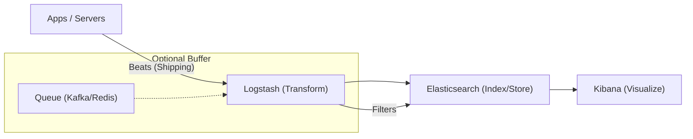

## 📌 Özet
ELK Stack (Elasticsearch, Logstash, Kibana) ve yeni nesil hafif versiyonu olan EFK (Fluentd/Fluent Bit), dağıtık sistemlerde logların merkezi bir noktada toplanması, indekslenmesi ve analiz edilmesi için kullanılır. Loglar, metriklerin aksine "neden" sorusuna cevap veren zengin metinsel verilerdir. Elasticsearch arama motoru işlevi görürken, Logstash veriyi dönüştürür ve Kibana görselleştirme sağlar. Modern sistemlerde log yönetimi, sadece hata ayıklama için değil, aynı zamanda güvenlik denetimi ve iş analitiği için de kritiktir. Bu notta, pipeline yapısını ve ölçeklenebilir log stratejilerini inceleyeceğiz.

## 🧠 Detay



### 1. Bileşenlerin Rolü
- **Elasticsearch:** Dağıtık, RESTful arama ve analitik motorudur. Log verilerini doküman tabanlı olarak saklar.
- **Logstash:** Veri toplama hattıdır. Giriş (Input), Filtre (Filter) ve Çıktı (Output) katmanlarından oluşur. Grok filtreleri ile düz metin logları yapılandırılmış JSON'a çevirir.
- **Kibana:** Elasticsearch verileri üzerinde arama yapmayı, dashboardlar oluşturmayı ve sistem sağlığını izlemeyi sağlar.
- **Beats:** Client tarafında çalışan hafif veri göndericilerdir (Filebeat, Metricbeat, Heartbeat).

### 2. Log Yapılandırma Stratejileri
- **Structured Logging:** Logları düz metin yerine JSON formatında üretmek, parse maliyetini düşürür ve arama doğruluğunu artırır.
- **Contextual Info:** Loglara her zaman `request_id`, `user_id`, `env` ve `service_name` gibi bağlamsal veriler ekleyin.

### Logstash Filtre Örneği
```ruby
filter {
  if [type] == "apache" {
    grok {
      match => { "message" => "%{COMBINEDAPACHELOG}" }
    }
    date {
      match => [ "timestamp" , "dd/MMM/yyyy:HH:mm:ss Z" ]
    }
  }
}
```

### 3. Ölçeklenebilirlik: Kafka Kullanımı
Log hacmi çok arttığında Elasticsearch veya Logstash darboğaz oluşturabilir. Bu durumda araya **Apache Kafka** bir buffer (tampon) olarak eklenir. Bu, sistem ani trafik aldığında log kaybını önler.

### SRE Best Practices
- **Retention Policy:** Logları sonsuza kadar saklamayın. ILM (Index Lifecycle Management) ile eski logları silin veya soğuk depolamaya (S3) taşıyın.
- **Sensitive Data:** Loglarda asla şifre, API key veya PII (Kişisel Veri) saklamayın. Logstash filtreleri ile bu verileri maskeleyin.
- **Alerting on Logs:** Sık tekrarlanan hata logları (örn: 1 dakikada 100 tane 'NullPointerException') için uyarı mekanizması kurun.

## 💡 Bağlantılar
- [[MO - Distributed Tracing ve Jaeger]]
- [[MO - Giriş: Monitoring vs Observability (Three Pillars)]]
