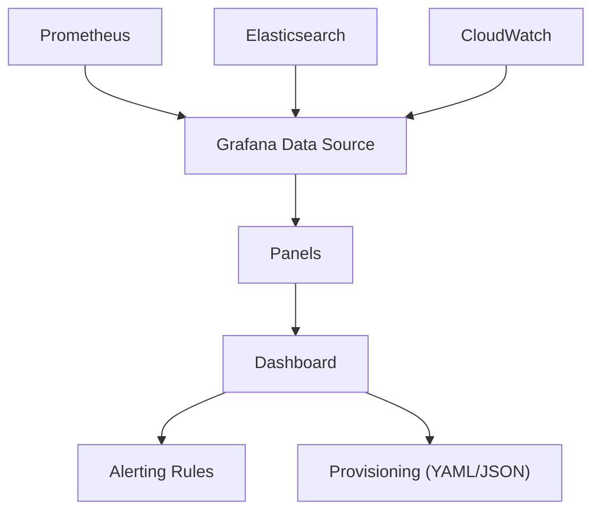

## 📌 Özet
Grafana, çok sayıda veri kaynağından (Prometheus, Elasticsearch, InfluxDB, CloudWatch) gelen verileri görselleştirmek için kullanılan en popüler açık kaynaklı platformdur. "Herkes için veri" mottosuyla, teknik olmayan paydaşların bile sistem durumunu anlamasını sağlayan güçlü dashboardlar oluşturulmasına imkan tanır. Metrikleri grafiklere, tablolara ve heatmap'lere dönüştürerek operasyonel görünürlüğü maksimize eder. Bu notta, etkili dashboard tasarımı, değişken kullanımı ve "Dashboard as Code" yaklaşımlarını inceleyeceğiz. SRE perspektifinden, bir dashboard sadece güzel görünmemeli, aynı zamanda hızlı aksiyon aldırabilmelidir.

## 🧠 Detay



### 1. Etkili Dashboard Prensipleri
- **The Golden Signals:** Latency, Traffic, Errors ve Saturation metrikleri her zaman üstte olmalıdır.
- **Logical Flow:** Yukarıdan aşağıya; genel durumdan (High-level) detaylara (Granular) doğru bir akış izleyin.
- **Simplicity:** Tek bir dashboard'da yüzlerce grafik bulundurmayın. Gereksiz grafikler bilişsel yükü artırır.
- **Color Coding:** Kırmızı=Kritik, Sarı=Uyarı, Yeşil=Normal gibi standart renkler kullanın.

### 2. Değişkenler (Variables) ve Şablonlama
Değişkenler, aynı dashboard'u farklı clusterlar, namespace'ler veya instance'lar için kullanmanızı sağlar.
- **Query Variable:** Prometheus'tan label değerlerini çekerek dinamik filtreleme yapar.
- **Ad-hoc Filters:** Kullanıcının çalışma anında manuel filtreler eklemesine olanak tanır.

### 3. Dashboard as Code (Grizzly / Terraform)
Dashboardların manuel olarak UI'dan oluşturulması hata payını artırır ve versiyon kontrolü yapılamaz.
- **JSON Model:** Grafana dashboardları aslında devasa JSON dosyalarıdır.
- **Provisioning:** `/etc/grafana/provisioning/dashboards` altına atılan JSON/YAML dosyaları ile otomatik yükleme yapılır.

```yaml
apiVersion: 1
providers:
- name: 'Standard Dashboards'
  orgId: 1
  folder: 'Operations'
  type: file
  disableDeletion: false
  editable: true
  options:
    path: /var/lib/grafana/dashboards
```

### SRE Best Practices
- **Annotation:** Deployment anlarını veya büyük hata eventlerini grafikler üzerinde işaretleyerek anomalilerin nedenini hızla bulun.
- **Mobile Friendly:** Kritik dashboardları mobil cihazlarda da okunabilir şekilde tasarlayın.
- **Access Control:** Hassas veriler içeren dashboardlara erişimi RBAC ile kısıtlayın.

## 💡 Bağlantılar
- [[MO - Prometheus ile Metrik Toplama]]
- [[MO - SRE Prensipleri ve Hata Bütçesi (SLI, SLO)]]
