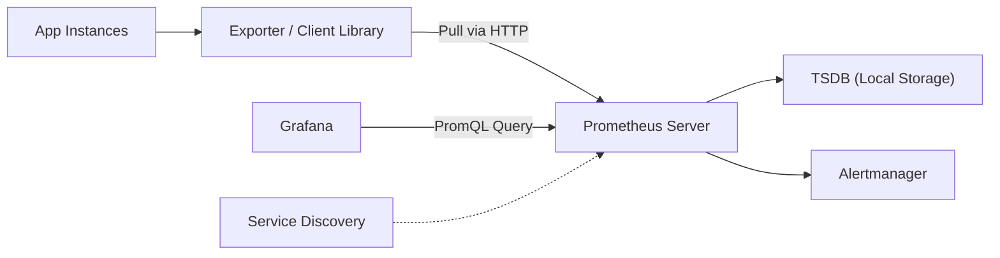

## 📌 Özet
Prometheus, Cloud Native Computing Foundation (CNCF) bünyesinde yer alan, açık kaynaklı ve zaman serisi tabanlı bir monitoring sistemidir. Özellikle dinamik mikroservis mimarileri ve Kubernetes ortamları için endüstri standardı haline gelmiştir. Prometheus, "pull-based" bir yaklaşımla hedeflerden (target) HTTP üzerinden metrikleri çeker ve güçlü PromQL dili ile sorgulama imkanı sunar. Bu notta, Prometheus mimarisini, metrik tiplerini ve veri toplama stratejilerini derinlemesine ele alacağız. SRE ekipleri için metrik toplamanın otomasyonu ve ölçeklenebilirliği sistem güvenilirliği açısından hayati önem taşır.

## 🧠 Detay



### 1. Prometheus Temel Metrik Tipleri
Prometheus dört ana metrik tipini destekler:
- **Counter:** Sadece artan (veya resetlenen) değerlerdir. (Örn: `http_requests_total`)
- **Gauge:** Anlık artıp azalabilen değerlerdir. (Örn: `memory_usage_bytes`, `temperature`)
- **Histogram:** Gözlemleri örneklendirir (genellikle süreler) ve yapılandırılabilir bucket'larda sayar. (Örn: `request_duration_seconds_bucket`)
- **Summary:** Histogram'a benzer ancak quantile'ları (p95, p99) client tarafında hesaplar.

### 2. Pull vs Push Yaklaşımı
Prometheus pull-based'dir, yani veriyi çeker. Ancak kısa ömürlü (ephemeral) işler için **Pushgateway** kullanılır.
- **Avantajı:** Merkezi konfigürasyon, kolay target kontrolü, sistem yükünün Prometheus tarafından kontrol edilmesi.
- **Exporterlar:** Uygulamanın içine kod eklenemediği durumlarda (Redis, MySQL, Node) metrikleri Prometheus formatına çeviren yan servislerdir.

### 3. PromQL Örneği
Saniyedeki ortalama HTTP hata oranını hesaplamak için:
```promql
sum(rate(http_requests_total{status=~"5.."}[5m])) 
/ 
sum(rate(http_requests_total[5m])) * 100
```

### Konfigürasyon Örneği (prometheus.yml)
```yaml
global:
  scrape_interval: 15s

scrape_configs:
  - job_name: 'node_exporter'
    static_configs:
      - targets: ['localhost:9100']
  - job_name: 'kubernetes-nodes'
    kubernetes_sd_configs:
      - role: node
```

### SRE Best Practices
- **Scrape Interval:** Kritik servisler için kısa (10-15s), daha az önemli servisler için uzun (1m) tutun.
- **Expose Only What Matters:** Çok fazla metrik toplamak "noise" yaratır; kritik sinyallere (Four Golden Signals) odaklanın.
- **Label Consistency:** Farklı servislerde aynı anlamdaki etiketleri (örn: `env` vs `environment`) standartlaştırın.

## 💡 Bağlantılar
- [[MO - Grafana ile Görselleştirme ve Dashboard]]
- [[MO - Alerting Stratejileri ve On-call Yönetimi]]
