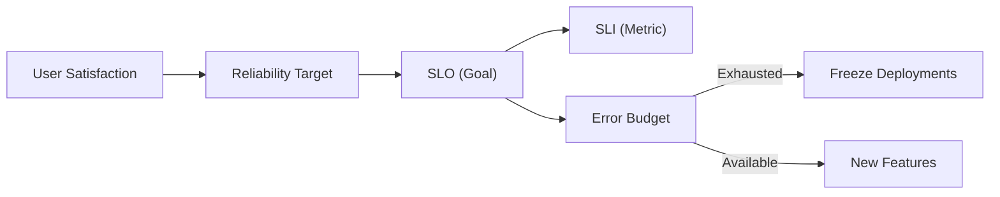

## 📌 Özet
Site Reliability Engineering (SRE), sistem yönetimine bir yazılım mühendisliği yaklaşımı getiren disiplindir. SRE'nin en temel amacı, "hız" (yeni özellikler ekleme) ve "güvenilirlik" (stabilite) arasındaki çatışmayı yönetmektir. Bu yönetim, SLI (Service Level Indicator), SLO (Service Level Objective) ve Error Budget (Hata Bütçesi) kavramları üzerine kuruludur. Hiçbir sistem %100 güvenilir olamaz; bu nedenle kabul edilebilir bir hata payı tanımlanır. Bu notta, güvenilirliği nasıl ölçtüğümüzü ve hata bütçesi tükendiğinde alınması gereken aksiyonları inceleyeceğiz.

## 🧠 Detay

### 1. Temel Tanımlar
| Kavram | Tanım | Örnek |
| :--- | :--- | :--- |
| **SLI** | Hizmet seviyesinin kantitatif ölçüsüdür. | "Başarılı HTTP isteklerinin %'si" |
| **SLO** | SLI için belirlenen hedef değerdir. | "%99.9 başarı oranı (aylık)" |
| **SLA** | SLO sağlanamadığında devreye giren yasal sözleşmedir. | "Kesinti olursa %10 indirim yapılır" |

### 2. Error Budget (Hata Bütçesi)
Error Budget, %100 ile SLO arasındaki farktır.
- **Hesaplama:** Eğer SLO %99.9 ise, aylık hata bütçesi %0.1'dir (yaklaşık 43 dakika kesinti süresi).
- **Kullanımı:** Bu bütçe, riskli güncellemeler, deneyler ve planlı bakım çalışmaları için kullanılır.
- **Politika:** Bütçe bittiğinde, sistem tekrar stabilize olana kadar tüm yeni özellik (feature) deployment'ları durdurulur; sadece güvenirlik ve hata düzeltme çalışmaları yapılır.

### 3. SLO Tasarımı
İyi bir SLO, kullanıcı mutluluğuyla doğrudan ilişkili olmalıdır.
- **Availability:** Sistem ayakta mı?
- **Latency:** Sistem yeterince hızlı mı?
- **Throughput:** Sistem yükü kaldırabiliyor mu?

### SRE Best Practices
- **Windowing:** SLO'ları genellikle 28 veya 30 günlük kayan pencereler (rolling windows) üzerinden takip edin.
- **Toil Management:** Manuel, tekrarlayan ve otomatize edilebilir işleri (toil) %50'nin altında tutun.
- **Blameless Post-mortems:** Hatalardan sonra suçlu aramak yerine, sistemdeki zayıflıkları bulmaya odaklanın.

## 💡 Bağlantılar
- [[MO - Alerting Stratejileri ve On-call Yönetimi]]
- [[MO - Giriş: Monitoring vs Observability (Three Pillars)]]
