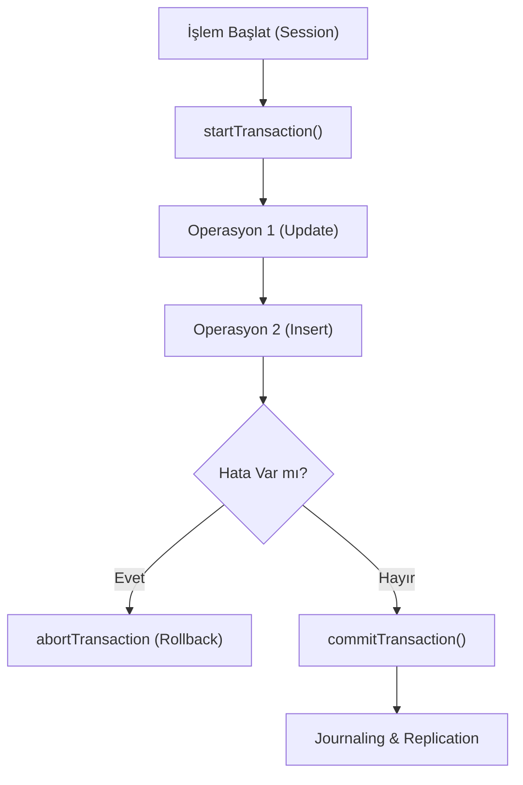

## 📌 Özet
MongoDB, sürüm 4.0 ile birlikte çoklu döküman (multi-document) işlemleri için tam ACID desteği sunmaya başlamıştır. Bu özellik, finansal transferler veya karmaşık sipariş sistemleri gibi "ya hep ya hiç" mantığıyla çalışması gereken işlemler için kritik öneme sahiptir. WiredTiger depolama motorunun snapshot yeteneklerini kullanan bu yapı; atomiklik, tutarlılık, izolasyon ve dayanıklılığı garanti eder. Ayrıca, Read/Write Concerns ayarları ile dağıtık sistemlerdeki veri güncelliği ve kalıcılığı hassas bir şekilde yönetilebilir.

## 🧠 Detay

### 1. ACID Prensipleri
- **Atomicity:** İşlem içindeki tüm adımlar tek bir birim olarak ele alınır.
- **Snapshot Isolation:** İşlem süresince verinin tutarlı bir kopyası üzerinde çalışılır.

### 2. Read ve Write Concerns
- **Write Concern (w: majority):** Verinin Replica Set üyelerinin çoğunluğuna yazıldığını onaylar.
- **Read Concern (level: snapshot):** İşlem boyunca en güncel ve tutarlı veriyi okumayı sağlar.

## 💡 Bağlantılar
- [[MongoDB - CRUD İşlemleri]]
- [[MongoDB - Replikasyon ve Sharding]]

## ❓ Sorular / Anlamadıklarım

## 🔗 Kaynaklar
- MongoDB Transactions Documentation
- Jepsen Analysis: MongoDB Consistency
