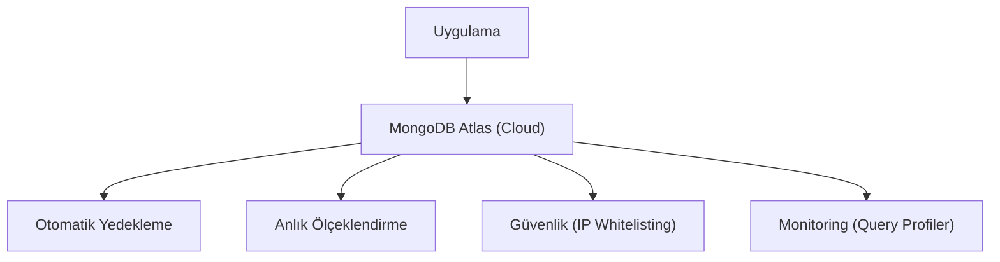

## 📌 Özet
MongoDB Atlas, tam yönetilen (fully managed) bir bulut veritabanı hizmetidir (DBaaS). AWS, Google Cloud ve Azure üzerinde çalışabilir. Kurulum, yedekleme, ölçeklendirme ve güvenlik yamaları gibi operasyonel yükleri otomatikleştirerek geliştiricilerin sadece uygulamaya odaklanmasını sağlar. Ücretsiz katman (M0) ile öğrenme süreçlerini desteklerken, kurumsal seviyede global kümeler ve gelişmiş performans analitiği sunar.

## 🧠 Detay

### 1. Temel Özellikler
- **VPC Peering:** Uygulama sunucusuyla veritabanı arasında güvenli ağ bağlantısı.
- **Data Federation:** S3 veya diğer kaynaklardaki verilerle MongoDB verilerini tek sorguda birleştirme.

### 2. Bağlantı Ayarları
1. Network Access (IP Ekleme).
2. Database Access (Kullanıcı Oluşturma).
3. Connection String (URI Alımı).

## 💡 Bağlantılar
- [[MongoDB - Giriş ve Temel Kavramlar]]
- [[MongoDB - Güvenlik ve Yetkilendirme]]

## ❓ Sorular / Anlamadıklarım

## 🔗 Kaynaklar
- MongoDB Atlas Official Site
- Cloud Security Best Practices
