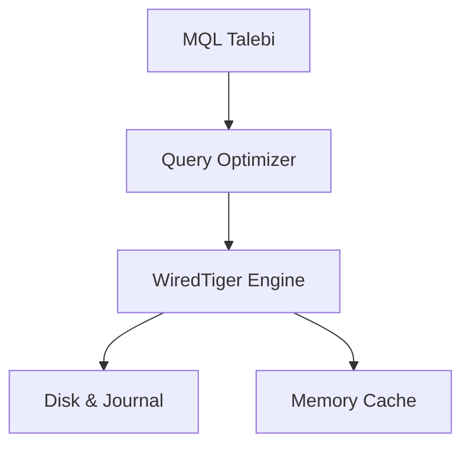

## 📌 Özet
CRUD (Create, Read, Update, Delete) işlemleri, döküman tabanlı veri yönetiminin temelini oluşturur. MongoDB'de bu işlemler MQL (MongoDB Query Language) kullanılarak JSON benzeri BSON formatında gerçekleştirilir. Her dökümana benzersiz bir `_id` atanır. Güncelleme işlemleri `$set` gibi operatörlerle atomik olarak yapılırken, sorgulama işlemleri zengin operatör setiyle son derece esnektir.

## 🧠 Detay

### 1. Veri Ekleme (Create)
`insertOne()` veya `insertMany()` metodları kullanılır.

### 2. Sorgulama (Read)
`find(filtre, projection)` metoduyla yapılır. Cursor yapısı sayesinde büyük veri setleri parçalı olarak okunabilir.

### 3. Güncelleme (Update)
`updateOne()` veya `updateMany()` ile yapılır. `$inc`, `$push` ve `$unset` gibi birçok yardımcı operatör mevcuttur.

## 💡 Bağlantılar
- [[MongoDB - Sorgulama ve Operatörler]]
- [[MongoDB - İndeksler ve Performans]]

## ❓ Sorular / Anlamadıklarım

## 🔗 Kaynaklar
- MongoDB CRUD Guide
- MQL Operators Reference
