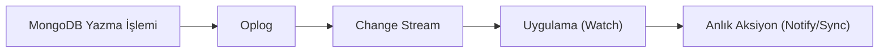

## 📌 Özet
Change Streams, veritabanındaki veri değişikliklerini (insert, update, delete vb.) gerçek zamanlı olarak izlemek ve bu değişikliklere anlık tepki vermek için kullanılan bir özelliktir. Veritabanını bir olay kaynağına (event source) dönüştürerek, uygulamaların sürekli sorgu (polling) yapma zorunluluğunu ortadan kaldırır. Replica Set'lerin oplog yapısını kullanan bu özellik; anlık bildirimler, veri senkronizasyonu ve mikroservis tetikleme senaryoları için idealdir.

## 🧠 Detay

### 1. Nasıl Çalışır?
`.watch()` metodu ile bir koleksiyon veya veritabanı dinlemeye alınır. Değişiklik olduğunda dökümanın tam hali veya sadece değişen alanlar olay nesnesi olarak yakalanır.

### 2. Filtreleme
Aggregation pipeline operatörleri ile sadece belirli alanlardaki veya belirli tipteki değişiklikler izlenebilir.

## 💡 Bağlantılar
- [[MongoDB - Replikasyon ve Sharding]]
- [[MongoDB - Aggregation Pipeline]]

## ❓ Sorular / Anlamadıklarım

## 🔗 Kaynaklar
- MongoDB Change Streams Documentation
- Real-time apps with MongoDB
