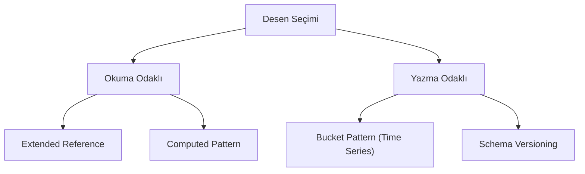

## 📌 Özet
MongoDB'de veri modelleme tasarım desenleri, NoSQL'in esnek yapısını verimli kullanmak ve performansı optimize etmek için geliştirilmiş standart yollardır. İlişkisel veritabanlarının aksine, burada desenler "uygulama nasıl sorgu atacak?" sorusuna göre şekillenir. Extended Reference, Bucket, Attribute ve Outlier gibi desenler, JOIN işlemlerini azaltmayı ve disk/bellek kullanımını dengelemeyi amaçlar.

## 🧠 Detay

### 1. Popüler Desenler
- **Extended Reference:** Sık kullanılan alanları dökümana kopyalar.
- **Bucket Pattern:** Zaman serisi verilerini gruplayarak döküman sayısını azaltır.
- **Attribute Pattern:** Benzer dökümanlardaki farklı alanları standartlaştırır.

### 2. Şema Esnekliği
Desenler, veritabanını durdurmadan şema güncellemeleri yapmaya (Schema Versioning) olanak tanır.

## 💡 Bağlantılar
- [[MongoDB - Şema Tasarımı ve Veri Modelleme]]
- [[MongoDB - İndeksler ve Performans]]

## ❓ Sorular / Anlamadıklarım

## 🔗 Kaynaklar
- MongoDB Patterns Catalog
- Designing Data-Intensive Applications (M. Kleppmann)
