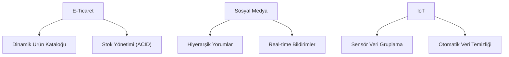

## 📌 Özet
MongoDB'nin esnek şema ve ölçeklenebilirlik yetenekleri, onu e-ticaretten finansal sistemlere, sosyal medya platformlarından IoT veri yönetimine kadar pek çok sektörde ideal çözüm haline getirir. Gerçek dünya senaryolarında; karmaşık ürün katalogları, hiyerarşik yorum sistemleri ve yüksek frekanslı sensör verileri MongoDB'nin temel uzmanlık alanlarıdır. Bu notta, farklı endüstrilerden somut vaka çalışmaları ve uygulanan mimari stratejiler ele alınmaktadır.

## 🧠 Detay

### 1. Senaryo: Ürün Kataloğu
Farklı özelliklere sahip milyonlarca ürünü, şema kısıtlaması olmadan tek bir koleksiyonda yönetme esnekliği.

### 2. Senaryo: Real-time Analytics
Change Streams kullanarak veri değişimlerini anlık olarak izleyip dashboard'lara yansıtma.

## 💡 Bağlantılar
- [[MongoDB - Data Modeling Design Patterns]]
- [[MongoDB - Transactions ve ACID]]

## ❓ Sorular / Anlamadıklarım

## 🔗 Kaynaklar
- MongoDB Industry Case Studies
- Architecture Guides
