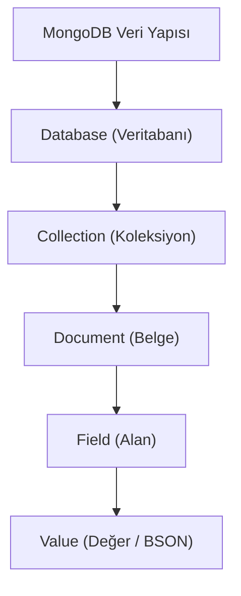

## 📌 Özet
MongoDB, modern uygulama geliştiricileri için tasarlanmış, açık kaynaklı ve döküman tabanlı bir NoSQL veritabanıdır. Verileri SQL'deki gibi satır ve sütunlarda değil, JSON benzeri esnek BSON dökümanlarında saklar. Bu yapı, karmaşık veri hiyerarşilerinin doğal bir şekilde temsil edilmesini sağlar. Yatay ölçeklenebilirlik ve yüksek erişilebilirlik gibi yerleşik özellikleri sayesinde, küçük prototiplerden devasa kurumsal sistemlere kadar her ölçekte performans sunar.

## 🧠 Detay

### 1. SQL ve MongoDB Terim Karşılıkları
- Table -> **Collection**
- Row -> **Document**
- Column -> **Field**
- Join -> **$lookup / Embedding**

### 2. Temel Avantajlar
- **Esnek Şema:** Her döküman farklı alanlara sahip olabilir.
- **Performans:** Bellek içi (In-memory) işleme yetenekleri ve WiredTiger motoru.
- **Ölçekleme:** Sharding ile veriyi binlerce sunucuya dağıtabilme.

## 💡 Bağlantılar
- [[MongoDB - CRUD İşlemleri]]
- [[MongoDB - Şema Tasarımı ve Veri Modelleme]]

## ❓ Sorular / Anlamadıklarım

## 🔗 Kaynaklar
- MongoDB Manual: Introduction
- NoSQL Distilled (Pramod Sadalage)
