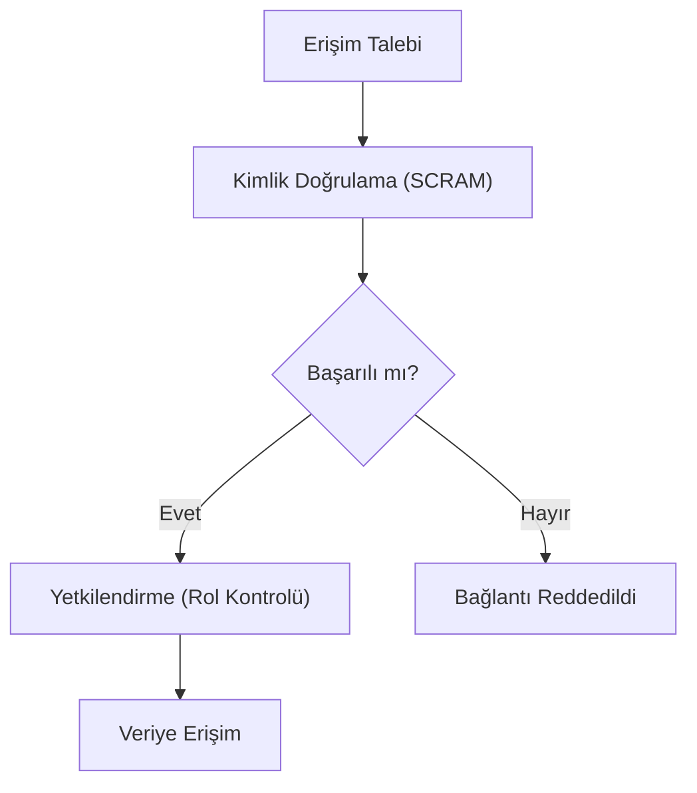

## 📌 Özet
MongoDB güvenliği, verilerin yetkisiz erişime karşı korunması için tasarlanmış; kimlik doğrulama, yetkilendirme ve şifreleme katmanlarından oluşan kapsamlı bir çerçevedir. Rol Tabanlı Erişim Kontrolü (RBAC) ile kullanıcılara "en az yetki" ilkesine göre kısıtlı alanlar tanımlanır. Verilerin hem diskte (at-rest) hem de ağda (in-transit) şifrelenmesi standart bir zorunluluktur. Bu notta, güvenli bir MongoDB kurulumu için gereken temel sıkılaştırma adımları incelenmektedir.

## 🧠 Detay

### 1. Kimlik Doğrulama
SCRAM (Varsayılan), x.509 Sertifikaları veya LDAP/Active Directory entegrasyonu.

### 2. Yetkilendirme (RBAC)
Kullanıcılara `read`, `readWrite`, `dbAdmin` gibi yerleşik roller veya özel tanımlanmış roller atanması.

### 3. Şifreleme
- **TLS/SSL:** Ağ trafiğinin korunması.
- **Encryption at Rest:** Verilerin diskte AES-256 ile saklanması.

## 💡 Bağlantılar
- [[MongoDB - Atlas ve Cloud Kullanımı]]
- [[MongoDB - Transactions ve ACID]]

## ❓ Sorular / Anlamadıklarım

## 🔗 Kaynaklar
- MongoDB Security Guide
- Security Best Practices (Official)
