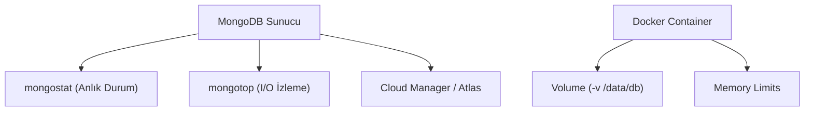

## 📌 Özet
MongoDB'nin sağlıklı çalışması için sistem kaynaklarının, sorgu performansının ve küme durumunun sürekli izlenmesi hayati önem taşır. Modern altyapılarda MongoDB genellikle Docker gibi konteyner platformları üzerinde çalıştırılarak taşınabilirlik sağlanır. Ancak konteyner kullanımında volume yapılandırması ve bellek limitleri performansı doğrudan etkiler. Bu notta, yerleşik izleme araçları ve Dockerize edilmiş deployment stratejileri ele alınmaktadır.

## 🧠 Detay

### 1. Yerleşik Araçlar
- **mongostat:** insert/query/update sayılarını ve RAM kullanımını gösterir.
- **mongotop:** Hangi koleksiyonun ne kadar süre kilitlendiğini (latency) gösterir.

### 2. Docker ile Çalıştırma
Veri kalıcılığı için mutlaka host mount veya named volume kullanılmalıdır.
`docker run -v mongo_data:/data/db mongo`

## 💡 Bağlantılar
- [[Docker - Giriş ve Temel Kavramlar]]
- [[MongoDB - İndeksler ve Performans]]

## ❓ Sorular / Anlamadıklarım

## 🔗 Kaynaklar
- MongoDB Monitoring Documentation
- Docker Hub: Official Mongo Image
