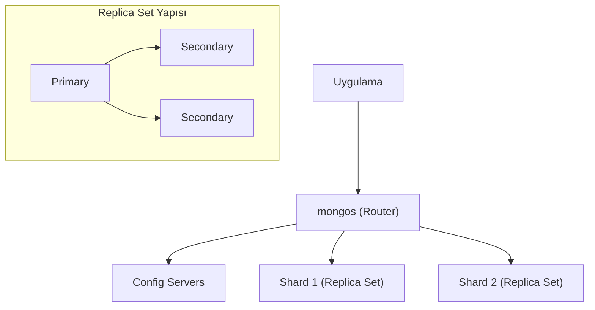

## 📌 Özet
MongoDB, veriyi hem güvende tutmak (Replikasyon) hem de sonsuz büyütebilmek (Sharding) için gelişmiş mimari özellikler sunar. Replikasyon (Replica Set), verinin birden fazla sunucuya kopyalanarak yüksek erişilebilirlik sağlanmasıdır. Sharding ise devasa veri kümelerinin parçalara (shard) bölünerek farklı sunuculara dağıtılması yoluyla yatay ölçekleme kazandırılmasıdır. Bu iki yapı kurumsal sistemlerin omurgasını oluşturur.

## 🧠 Detay

### 1. Replica Set (HA)
- **Primary:** Yazma işlemlerini yapan ana sunucu.
- **Secondary:** Veriyi kopyalayan ve okuma yükünü alan sunucular.

### 2. Sharding (Scalability)
- **Shard Key:** Verinin hangi sunucuya gideceğini belirleyen anahtar.
- **Balancer:** Veri dağılımını shardlar arasında otomatik dengeler.

## 💡 Bağlantılar
- [[MongoDB - Sharding Stratejileri ve Cluster Yönetimi]]
- [[MongoDB - Monitoring Yönetim ve Docker]]

## ❓ Sorular / Anlamadıklarım

## 🔗 Kaynaklar
- MongoDB High Availability Guide
- Sharding Best Practices
