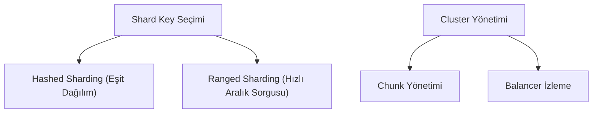

## 📌 Özet
Sharding, MongoDB'de yatay ölçekleme yapmanın en ileri yoludur. Veri miktarının tek sunucu kapasitesini aştığı durumlarda "shard key" üzerinden veriyi parçalara (chunks) ayırıp dağıtır. Doğru anahtar seçimi, dengeli bir dağılım ve verimli sorgu yönlendirme için kritiktir. Bu notta, shard anahtarı stratejileri ve küme sağlığı yönetimi incelenmektedir.

## 🧠 Detay

### 1. Shard Key Türleri
- **Hashed:** Veriyi rastgele dağıtır, hotspotları engeller.
- **Ranged:** Benzer verileri yan yana tutar, aralık sorgularında performans sağlar.

### 2. Bileşenler
- **mongos:** İstemci taleplerini doğru shard'a yönlendirir.
- **Config Servers:** Kümenin haritasını tutar.

## 💡 Bağlantılar
- [[MongoDB - Replikasyon ve Sharding]]
- [[MongoDB - Monitoring Yönetim ve Docker]]

## ❓ Sorular / Anlamadıklarım

## 🔗 Kaynaklar
- Choosing a Shard Key
- MongoDB Sharding Internals
