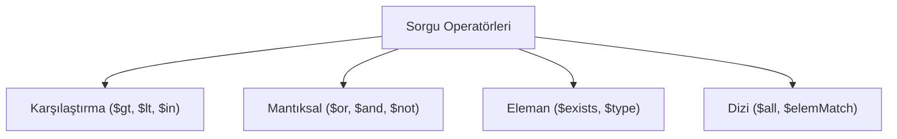

## 📌 Özet
MQL (MongoDB Query Language), döküman tabanlı veriler üzerinde esnek aramalar yapmak için tasarlanmıştır. Karşılaştırma, mantıksal, dizi ve eleman bazlı operatörler sayesinde karmaşık filtreler oluşturulabilir. SQL'deki `WHERE` ifadesinin yerini alan bu yapı, JSON formatında ifade edilir.

## 🧠 Detay

### 1. Karşılaştırma
- `$gt / $lt`: Büyüktür / Küçüktür.
- `$in`: Belirtilen dizideki değerlerden biriyle eşleşenler.

### 2. Dizi Operatörleri
- `$elemMatch`: Bir dizideki elemanın birden fazla şartı sağlaması durumunda kullanılır.

## 💡 Bağlantılar
- [[MongoDB - CRUD İşlemleri]]
- [[MongoDB - Aggregation Pipeline]]

## ❓ Sorular / Anlamadıklarım

## 🔗 Kaynaklar
- Query Operators Reference
- MQL vs SQL Comparison
