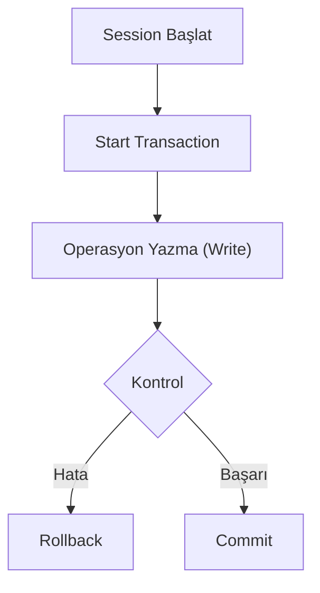

## 📌 Özet
MongoDB'de işlemler (transactions), çoklu dökümanlar üzerinde yapılan değişikliklerin "ya hep ya hiç" prensibiyle uygulanmasını sağlar. WiredTiger motorunun sağladığı snapshot izolasyonu ile bir işlem devam ederken verinin tutarlı bir kopyası üzerinde çalışılır. Bu notta, işlemlerin yaşam döngüsü ve geri alma (rollback) süreçleri teknik olarak ele alınmaktadır.

## 🧠 Detay

### 1. Kullanım Kuralları
- İşlemler Replica Set veya Sharded Cluster üzerinde çalışmalıdır.
- İşlem süresi (default 60 saniye) aşılmamalıdır.

### 2. İzolasyon
Yazma işlemleri commit edilene kadar diğer kullanıcılar tarafından görülmez (Snapshot Isolation).

## 💡 Bağlantılar
- [[MongoDB - ACID Transactions ve Tutarlılık Seviyeleri]]
- [[MongoDB - Replikasyon ve Sharding]]

## ❓ Sorular / Anlamadıklarım

## 🔗 Kaynaklar
- Multi-document Transactions in MongoDB
- WiredTiger Storage Engine Snapshotting
