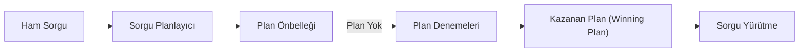

## 📌 Özet
İleri düzey aggregation ve sorgu optimizasyonu, veritabanı motorunun çalışma prensiplerini anlayarak devasa veri kümeleri üzerinde yüksek performanslı sonuçlar elde etmeyi amaçlar. Pipeline aşamalarının sırası, bellek limitleri ve indeks kullanımı performansı doğrudan etkiler. `explain()` metodundan gelen verilerle "Collection Scan" işlemlerinin tespit edilip "Index Seek" işlemlerine dönüştürülmesi bu sürecin temelidir.

## 🧠 Detay

### 1. Pipeline Optimizasyon Kuralları
- **$match ve $sort:** Her zaman pipeline'ın en başında ve mümkünse indeksli alanlar üzerinde olmalıdır.
- **Projection:** Sadece ihtiyaç duyulan alanların taşınması RAM yükünü azaltır.

### 2. explain() Analizi
`executionStats` modu ile taranan döküman sayısı ile dönen döküman sayısı arasındaki oran izlenmelidir.

## 💡 Bağlantılar
- [[MongoDB - Aggregation Pipeline]]
- [[MongoDB - İndeksler ve Performans]]

## ❓ Sorular / Anlamadıklarım

## 🔗 Kaynaklar
- MongoDB Query Optimization Guide
- Analyzing Query Performance
