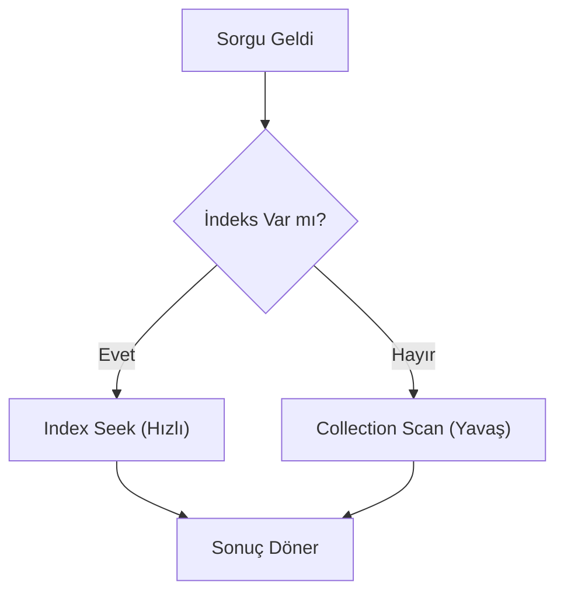

## 📌 Özet
İndeksleme, MongoDB'de sorgu performansını artırmanın en etkili yoludur. İndeksler olmadan veritabanı, her sorgu için tüm koleksiyonu taramak (Collection Scan) zorunda kalır. Doğru indeksleme stratejisi; tek alanlı, bileşik (compound), metin ve coğrafi indekslerin ihtiyaca göre planlanmasını içerir. Ancak, her indeksin yazma işlemlerine ek maliyet getirdiği ve RAM tükettiği unutulmamalıdır.

## 🧠 Detay

### 1. İndeks Türleri
- **Single Field:** Tek bir alan (örn: `email`).
- **Compound Index:** Birden fazla alanın kombinasyonu (örn: `ad` + `soyad`).
- **Multikey:** Dizi tipi alanları indeksleme.
- **TTL Index:** Veriyi belirli bir süre sonra otomatik silme.

### 2. Performans İpuçları
- **Working Set:** En sık kullanılan indekslerin RAM'e sığması gerekir.
- **ESR Kuralı:** Bileşik indekslerde Equality, Sort, Range sıralaması izlenmelidir.

## 💡 Bağlantılar
- [[MongoDB - CRUD İşlemleri]]
- [[MongoDB - İleri Aggregation ve Sorgu Optimizasyonu]]

## ❓ Sorular / Anlamadıklarım

## 🔗 Kaynaklar
- MongoDB Indexing Overview
- Performance Best Practices
