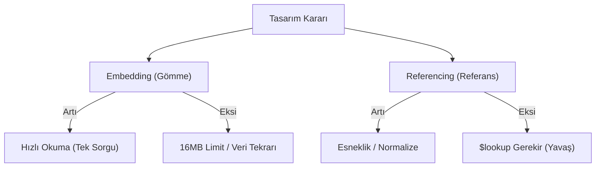

## 📌 Özet
MongoDB'de şema tasarımı, "uygulama veriyi nasıl okuyacak?" sorusu etrafında şekillenir. Normalize edilmiş tablolar yerine, verilerin iç içe gömülmesi (Embedding) veya ID ile bağlanması (Referencing) arasında seçim yapılır. Esnek şema, her dökümanın farklı alanlara sahip olmasına izin verir. Tasarımın temel amacı, okuma hızını maksimize etmek ve JOIN maliyetini düşürmektir.

## 🧠 Detay

### 1. Temel İlke
"Veri beraber okunuyorsa, beraber saklanmalıdır."

### 2. İlişki Yönetimi
- **1:1**: Genellikle Embedding.
- **1:N**: Az veri varsa Embedding, çok veri (binlerce) varsa Referencing.

## 💡 Bağlantılar
- [[MongoDB - Data Modeling Design Patterns]]
- [[MongoDB - Giriş ve Temel Kavramlar]]

## ❓ Sorular / Anlamadıklarım

## 🔗 Kaynaklar
- Data Modeling Introduction
- MongoDB Schema Design Best Practices
