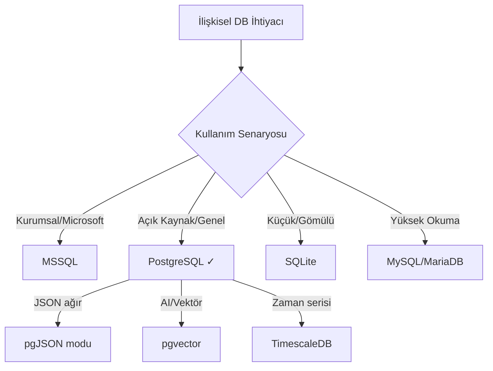

## 📌 Özet

PostgreSQL, dünyanın en gelişmiş açık kaynak ilişkisel veritabanı yönetim sistemidir. ACID uyumlu, genişletilebilir, JSON desteğiyle hem ilişkisel hem döküman veritabanı olarak kullanılabilir. Data Science ve ML workflow'larında MSSQL'in açık kaynak alternatifi.

---

## 🧠 Detay

### Bu Klasörde Ne Var?

| Not | Konu | Seviye |
|-----|------|--------|
| [[PG - PostgreSQL Kurulum ve Temel Yapılandırma]] | Kurulum, psql, bağlantı | Başlangıç |
| [[PG - SQL Temelleri ve PostgreSQL Sözdizimi]] | SELECT, JOIN, subquery | Başlangıç |
| [[PG - İleri SQL — Window Functions ve CTE]] | Analitik sorgular | Orta |
| [[PG - PostgreSQL Veri Tipleri]] | JSONB, Arrays, UUID | Orta |
| [[PG - İndeksleme Stratejileri]] | B-tree, GIN, GiST | Orta |
| [[PG - Performans Optimizasyonu]] | EXPLAIN ANALYZE, tuning | İleri |
| [[PG - Partitioning ve Tablo Bölümleme]] | Range, List, Hash | İleri |
| [[PG - PostgreSQL ile Python]] | psycopg2, SQLAlchemy | Orta |
| [[PG - Replikasyon ve Yüksek Erişilebilirlik]] | Streaming replication | İleri |
| [[PG - PostgreSQL Güvenliği]] | RLS, şifreleme | Orta |
| [[PG - pgvector ile Vektör Arama]] | AI entegrasyonu | İleri |
| [[PG - Full-Text Search]] | tsvector, tsquery | Orta |
| [[PG - Stored Procedures ve Triggers]] | PL/pgSQL | İleri |
| [[PG - PostgreSQL vs MSSQL Karşılaştırması]] | Geçiş rehberi | Orta |

---

### PostgreSQL vs Diğerleri



### PostgreSQL Güçlü Yönleri

```
ACID Uyumluluk:  Atomicity, Consistency, Isolation, Durability
JSON/JSONB:      NoSQL benzeri esneklik, SQL performansı
Extensibility:   PostGIS (coğrafi), pgvector (AI), TimescaleDB
Window Functions: Analitik sorgular için güçlü
Full-Text Search: Elasticsearch'e alternatif
Row-Level Security: Satır bazlı erişim kontrolü
MVCC:            Çok versiyonlu eşzamanlılık kontrolü
```

### Neden Data Science'ta PostgreSQL?

```python
# Yaygın kullanım senaryoları:
senaryolar = {
    "Model Feature Store": "Eğitim/servis verisi saklamak",
    "Sonuç Depolama": "Tahmin sonuçları kaydetmek",
    "A/B Test Verisi": "Deney sonuçlarını sorgulamak",
    "pgvector ile RAG": "Embedding vektörü saklamak",
    "Analitik Sorgular": "Window functions ile kohort analizi",
    "dbt ile Dönüşüm": "Modern veri stack'inin merkezi"
}
```

### Öğrenme Yolu

```
Başlangıç (0-2 hafta):
  → Kurulum ve psql komutları
  → SELECT, WHERE, JOIN, GROUP BY
  → CREATE TABLE, INSERT, UPDATE, DELETE

Orta (2-6 hafta):
  → Window Functions ve CTE
  → JSONB sorgulama
  → İndeks oluşturma
  → Python bağlantısı

İleri (6+ hafta):
  → EXPLAIN ANALYZE ile performans
  → Partitioning
  → pgvector ile AI
  → Replikasyon kurulumu
```

---

## 💡 Bağlantılar
- [[MSSQL - SQL Temel Sorgular (SELECT, WHERE, ORDER BY, TOP)]]
- [[DATA SCIENCE & ML ÖĞRENME YOL HARİTASI]]
- [[GenAI - RAG Mimarisi ve Vektör Veritabanları]]

## ❓ Sorular / Anlamadıklarım

## 🔗 Kaynaklar
- [PostgreSQL Official Documentation](https://www.postgresql.org/docs/)
- [PostgreSQL Tutorial](https://www.postgresqltutorial.com/)
- [Use The Index, Luke](https://use-the-index-luke.com/)
