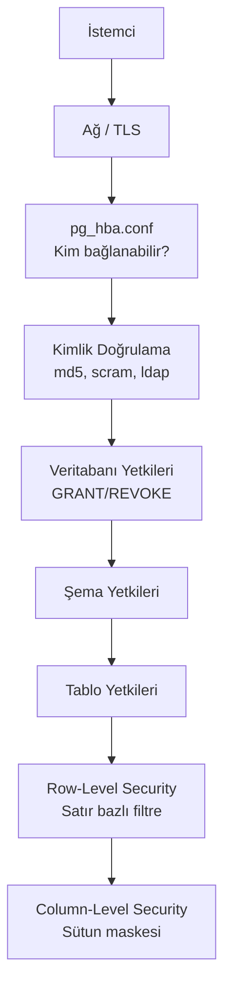

## 📌 Özet

PostgreSQL güvenliği çok katmanlıdır: ağ erişimi, kimlik doğrulama, yetkilendirme ve satır bazlı erişim kontrolü (RLS). SaaS uygulamalarda her kiracının yalnızca kendi verisini görmesi RLS ile sağlanır — uygulama katmanında if/else yazmadan.

---

## 🧠 Detay

### Güvenlik Katmanları



### Kullanıcı ve Rol Yönetimi

```sql
-- Rol oluştur
CREATE ROLE readonly_role NOLOGIN;
CREATE ROLE app_role NOLOGIN;

-- Kullanıcı oluştur
CREATE USER readonly_user WITH PASSWORD 'güçlü_parola' IN ROLE readonly_role;
CREATE USER app_user WITH PASSWORD 'güçlü_parola' IN ROLE app_role;

-- Minimal yetki prensibi — sadece lazım olanı ver
-- Readonly kullanıcı
GRANT CONNECT ON DATABASE mydb TO readonly_role;
GRANT USAGE ON SCHEMA public TO readonly_role;
GRANT SELECT ON ALL TABLES IN SCHEMA public TO readonly_role;

-- Uygulama kullanıcısı
GRANT CONNECT ON DATABASE mydb TO app_role;
GRANT USAGE ON SCHEMA public TO app_role;
GRANT SELECT, INSERT, UPDATE, DELETE ON ALL TABLES IN SCHEMA public TO app_role;
GRANT USAGE ON ALL SEQUENCES IN SCHEMA public TO app_role;

-- Gelecekte oluşturulacak tablolar için de yetki ver
ALTER DEFAULT PRIVILEGES IN SCHEMA public
    GRANT SELECT ON TABLES TO readonly_role;
ALTER DEFAULT PRIVILEGES IN SCHEMA public
    GRANT SELECT, INSERT, UPDATE, DELETE ON TABLES TO app_role;
```

### Row-Level Security (RLS) — Multi-Tenant

```sql
-- SaaS uygulaması: Her tenant kendi verisini görsün

CREATE TABLE projeler (
    id BIGSERIAL PRIMARY KEY,
    tenant_id INT NOT NULL,
    ad VARCHAR(255),
    veri JSONB
);

-- RLS aktifleştir
ALTER TABLE projeler ENABLE ROW LEVEL SECURITY;

-- Tenant kendi verilerini okuyabilir
CREATE POLICY tenant_izolasyon ON projeler
    USING (tenant_id = current_setting('app.current_tenant_id')::INT);

-- Admin tüm verileri görebilir
CREATE POLICY admin_tam_erisim ON projeler
    TO admin_role
    USING (TRUE);

-- Uygulama her requestte tenant'ı ayarlar
SET app.current_tenant_id = 42;
SELECT * FROM projeler;  -- Sadece tenant 42'nin verileri
```

### Gerçek Dünya RLS — FastAPI Entegrasyonu

```python
# Her API isteğinde tenant ayarla
from sqlalchemy import text

async def get_tenant_db(
    tenant_id: int,
    db: AsyncSession = Depends(get_db)
):
    # Oturum bazlı tenant ayarı
    await db.execute(
        text(f"SET LOCAL app.current_tenant_id = {tenant_id}")
    )
    return db

@app.get("/projeler")
async def projeler_listele(
    kullanici: User = Depends(get_current_user),
    db: AsyncSession = Depends(lambda: get_tenant_db(kullanici.tenant_id))
):
    sonuc = await db.execute(select(Proje))
    return sonuc.scalars().all()
    # RLS otomatik filtreler — uygulama kodu gerekmez
```

### Kolon Bazlı Güvenlik

```sql
-- Hassas sütunları maskeleme
CREATE VIEW kullanici_herkese AS
    SELECT
        id,
        ad,
        soyad,
        -- E-postayı maskele
        LEFT(email, 3) || '***@***' || RIGHT(email, 4) AS email,
        -- TC kimliği gizle (sadece son 4 rakam)
        '***-***-' || RIGHT(tc_kimlik, 4) AS tc_kimlik_maskeli,
        olusturma_tarihi
    FROM kullanicilar;

-- Hassas sütunlara erişimi kısıtla
REVOKE SELECT ON kullanicilar FROM app_role;
GRANT SELECT ON kullanici_herkese TO app_role;
-- Sadece DBA/admin gerçek tabloyu okuyabilir
```

### SSL/TLS Bağlantı

```ini
# postgresql.conf
ssl = on
ssl_cert_file = 'server.crt'
ssl_key_file = 'server.key'

# pg_hba.conf — SSL zorunlu kıl
hostssl  all  all  0.0.0.0/0  scram-sha-256
```

```python
# Python'da SSL ile bağlan
conn = psycopg2.connect(
    DSN,
    sslmode='require',          # require | verify-ca | verify-full
    sslrootcert='ca.crt',
    sslcert='client.crt',
    sslkey='client.key'
)
```

### Parola Politikası

```sql
-- SCRAM-SHA-256 kimlik doğrulama (md5'ten daha güvenli)
-- postgresql.conf
password_encryption = scram-sha-256

-- Parola politikası (passwordcheck extension)
CREATE EXTENSION IF NOT EXISTS passwordcheck;
-- Zayıf parola reddedilir

-- Kullanıcı parolasını güvenli şekilde değiştir
ALTER USER app_user PASSWORD 'Yeni_Güçlü_Parola_123!';
```

### Audit Log — Kim Ne Yaptı?

```sql
-- pgaudit extension
CREATE EXTENSION IF NOT EXISTS pgaudit;

-- postgresql.conf
pgaudit.log = 'write, ddl'   -- INSERT/UPDATE/DELETE + DDL'i logla
pgaudit.log_relation = on
pgaudit.log_parameter = on   -- Dikkat: hassas veri loglanabilir

-- Log örneği:
-- AUDIT: SESSION,1,1,WRITE,INSERT,TABLE,public.kullanicilar,
--        INSERT INTO kullanicilar(email) VALUES ($1),[ali@example.com]
```

### Güvenlik Kontrol Listesi

```
☐ Superuser kullanıcısı production'da kullanılmıyor
☐ Her uygulama için ayrı veritabanı kullanıcısı
☐ Minimal yetki prensibi uygulandı
☐ Parolalar güvenli yerde (Vault, .env, secrets manager)
☐ SSL bağlantısı zorunlu kılındı
☐ pg_hba.conf'ta IP kısıtlaması var
☐ RLS hassas tablolarda aktif
☐ pgaudit ile audit log aktif
☐ Otomatik VACUUM ve ANALYZE açık
☐ Yedekleme şifreli ve test edilmiş
```

---

## 💡 Bağlantılar
- [[PG - PostgreSQL Kurulum ve Temel Yapılandırma]]
- [[Siber Güvenlik - OWASP Top 10]]
- [[FastAPI - Güvenlik ve Kimlik Doğrulama]]
- [[DevSecOps - Secrets Management (Vault, AWS Secrets Manager)]]

## ❓ Sorular / Anlamadıklarım

## 🔗 Kaynaklar
- [pgaudit](https://www.pgaudit.org/)
- [PostgreSQL Security](https://www.postgresql.org/docs/current/security.html)
- [Supabase RLS Guide](https://supabase.com/docs/guides/auth/row-level-security)
