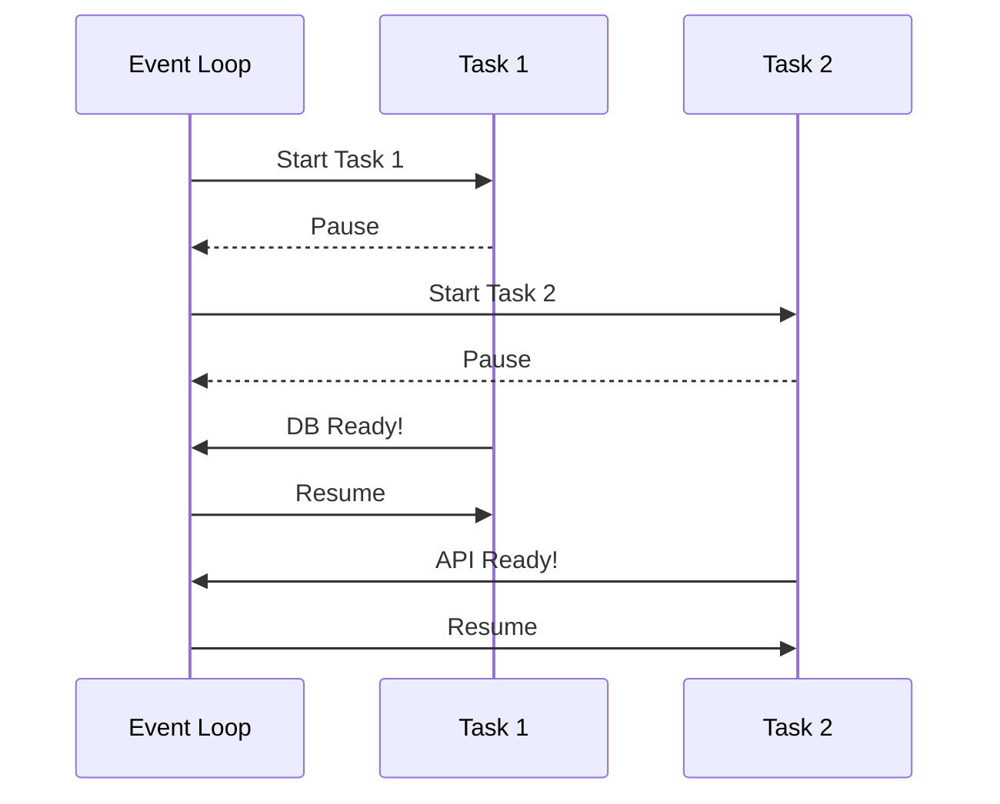

## 📌 Ozet
Python da asyncio, tek bir is parcacigi uzerinde eszamanli kod yazmamizi saglar.

## 🧠 Detay

```mermaid
sequenceDiagram
    participant EL as Event Loop
    participant T1 as Task 1
    participant T2 as Task 2
    EL->>T1: Start Task 1
    T1-->>EL: Pause
    EL->>T2: Start Task 2
    T2-->>EL: Pause
    T1->>EL: DB Ready!
    EL->>T1: Resume
    T2->>EL: API Ready!
    EL->>T2: Resume
```
