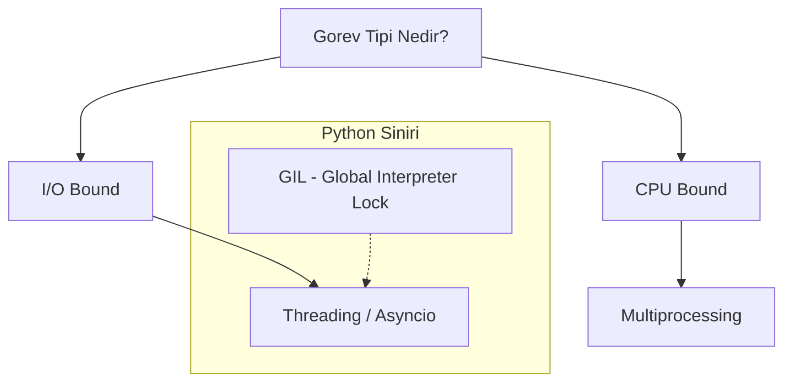

## 📌 Ozet
Python da eszamanlilik (concurrency) iki ana yontemle saglanir: Threading ve Multiprocessing.

## 🧠 Detay

```mermaid
graph TD
    Start["Gorev Tipi Nedir?"] --> IO["I/O Bound"]
    Start --> CPU["CPU Bound"]
    IO --> Threading["Threading / Asyncio"]
    CPU --> MP["Multiprocessing"]
    subgraph "Python Siniri"
    GIL["GIL - Global Interpreter Lock"] -.-> Threading
    end
```
