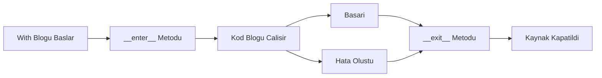

## 📌 Ozet
Context Manager lar, kaynaklarin guvenli bir sekilde acilmasini ve otomatik kapatilmasini saglar.

## 🧠 Detay

```mermaid
graph LR
    Start["With Blogu Baslar"] --> Enter["__enter__ Metodu"]
    Enter --> Execute["Kod Blogu Calisir"]
    Execute --> Success["Basari"]
    Execute --> Error["Hata Olustu"]
    Success --> Exit["__exit__ Metodu"]
    Error --> Exit
    Exit --> End["Kaynak Kapatildi"]
```
