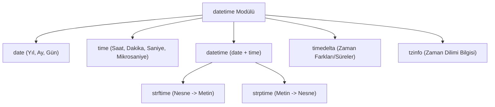

## 📌 Özet
Python'da tarih ve saat verileriyle çalışmak için yerleşik `datetime` modülü kullanılır. Bu modül; `date` (yalnızca tarih), `time` (yalnızca saat), `datetime` (hem tarih hem saat) ve `timedelta` (zaman farkı) gibi temel sınıflar sunarak zaman tabanlı verilerin yönetimini kolaylaştırır. Tarihlerin kullanıcı dostu metinlere dönüştürülmesi (strftime) veya metin tabanlı tarih verilerinin nesneye dönüştürülmesi (strptime) gibi kritik fonksiyonlarla veri işleme süreçlerinde büyük esneklik sağlar.

## 🧠 Detay



### Temel Kullanım
```python
from datetime import datetime, date, timedelta

# Bugün
bugun = date.today()
print(bugun)         # 2026-05-28

# Şu an
simdi = datetime.now()
print(simdi)         # 2026-05-28 14:30:00.123456

# Belirli tarih
d = date(2026, 1, 1)
dt = datetime(2026, 5, 28, 14, 30, 0)
```

### Tarih Formatlama
```python
simdi = datetime.now()

# datetime → string
print(simdi.strftime("%d.%m.%Y"))        # 28.05.2026
print(simdi.strftime("%Y-%m-%d %H:%M"))  # 2026-05-28 14:30

# string → datetime
tarih_str = "28.05.2026"
tarih = datetime.strptime(tarih_str, "%d.%m.%Y")
```

### Tarih Hesaplama
```python
from datetime import timedelta

bugun = date.today()
yarin = bugun + timedelta(days=1)
gecen_hafta = bugun - timedelta(weeks=1)

# İki tarih arası fark
d1 = date(2026, 1, 1)
d2 = date(2026, 5, 28)
fark = d2 - d1
print(fark.days)   # 147 gün
```

### Tarih Bileşenleri
```python
simdi = datetime.now()

print(simdi.year)     # 2026
print(simdi.month)    # 5
print(simdi.day)      # 28
print(simdi.hour)     # 14
print(simdi.weekday()) # 0=Pazartesi, 6=Pazar
```

## 💡 Bağlantılar
- [[Python - String İşlemleri]]
- [[Python - Modüller ve Paketler]]

## ❓ Sorular / Anlamadıklarım
- Zaman dilimi (timezone) işlemleri nasıl yapılır?
- `datetime` ile `pandas` tarih işlemleri arasındaki fark?

## 🔗 Kaynaklar
- https://docs.python.org/tr/3/library/datetime.html
