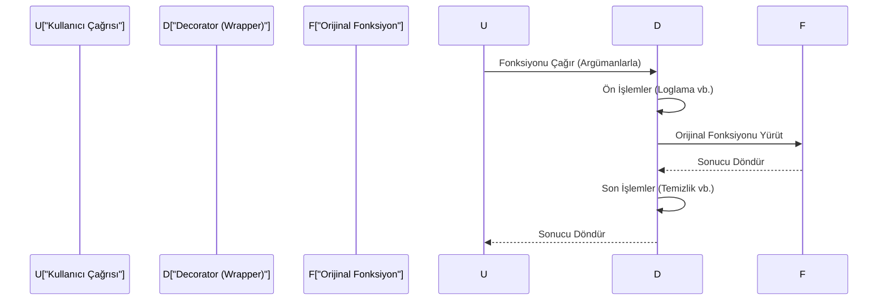

## 📌 Özet
Decorator'lar (Süsleyiciler), Python'da mevcut bir fonksiyonun veya sınıfın kodunu doğrudan değiştirmeden ona dinamik olarak yeni sorumluluklar veya davranışlar eklememizi sağlayan güçlü araçlardır. '@' sözdizimi ile kolayca uygulanan bu yapı, kod tekrarını önler ve 'Ayrılmış İlgi Alanları' (Separation of Concerns) prensibine uygun olarak loglama, kimlik doğrulama, önbellekleme ve performans ölçümü gibi yan etkileri ana mantıktan ayırır. Yüksek dereceli fonksiyonlar (higher-order functions) mantığına dayanan decorator'lar, hem fonksiyon hem de sınıf düzeyinde uygulanabilir.

## 🧠 Detay



### Temel Decorator
```python
def log_dekorator(fonksiyon):
    def sarici(*args, **kwargs):
        print(f"{fonksiyon.__name__} çalıştı")
        sonuc = fonksiyon(*args, **kwargs)
        print(f"{fonksiyon.__name__} bitti")
        return sonuc
    return sarici

@log_dekorator
def topla(a, b):
    return a + b

topla(3, 5)
# topla çalıştı
# topla bitti
```

### functools.wraps
```python
import functools

def log(func):
    @functools.wraps(func)    # metadata korur
    def wrapper(*args, **kwargs):
        print(f"Çağrıldı: {func.__name__}")
        return func(*args, **kwargs)
    return wrapper
```

### Parametreli Decorator
```python
def tekrarla(n):
    def decorator(func):
        @functools.wraps(func)
        def wrapper(*args, **kwargs):
            for _ in range(n):
                func(*args, **kwargs)
        return wrapper
    return decorator

@tekrarla(3)
def merhaba():
    print("Merhaba!")

merhaba()  # 3 kez yazdırır
```

### Zamanlama Decorator'ı
```python
import time

def zamanlayici(func):
    @functools.wraps(func)
    def wrapper(*args, **kwargs):
        baslangic = time.time()
        sonuc = func(*args, **kwargs)
        sure = time.time() - baslangic
        print(f"{func.__name__}: {sure:.4f} saniye")
        return sonuc
    return wrapper

@zamanlayici
def uzun_islem():
    time.sleep(1)
```

### Sınıf Decorator'ları
```python
# @property, @classmethod, @staticmethod
# bunlar da birer decorator'dır!
```

## 💡 Bağlantılar
- [[Python - Fonksiyonlar]]
- [[Python - OOP - Kapsülleme]]
- [[Python - Lambda ve Fonksiyonel Programlama]]

## ❓ Sorular / Anlamadıklarım
- `functools.wraps` olmadan ne kaybolur?
- Birden fazla decorator üst üste kullanılırsa sıra nasıl işler?

## 🔗 Kaynaklar
- https://docs.python.org/tr/3/glossary.html#term-decorator
