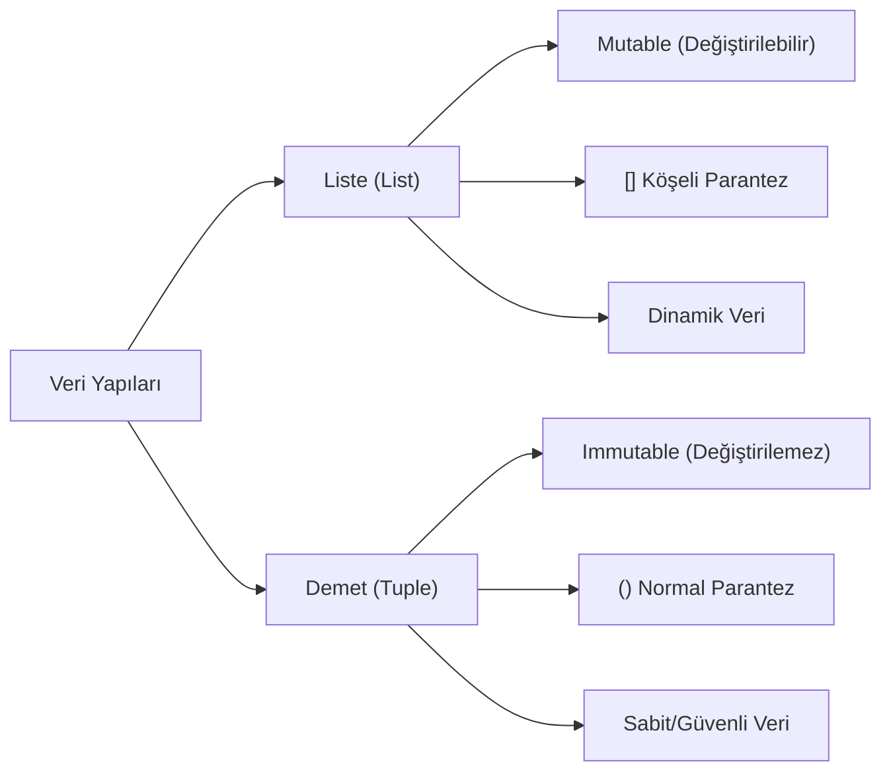

## 📌 Özet
Python'da Demetler (Tuple), sıralı ve değiştirilemez (immutable) veri koleksiyonlarıdır. Listelerden en temel farkı, bir kez oluşturulduktan sonra elemanlarının eklenememesi, silinememesi veya güncellenememesidir. Bu yapısal sabitlik, tuple'ları veritabanı kayıtları veya koordinatlar gibi değişmemesi gereken veri grupları için güvenli kılar. Ayrıca, değiştirilemez yapıları sayesinde listelere göre daha az bellek tüketirler ve daha yüksek erişim hızı sunarlar.

## 🧠 Detay



### Demet Oluşturma
```python
koordinat = (10, 20)
renkler = ("kırmızı", "yeşil", "mavi")
tek_elemanli = (42,)      # virgül zorunlu!
demetsiz = 1, 2, 3        # parantez opsiyonel
bos_demet = ()
```

### Elemanlara Erişim
```python
renkler = ("kırmızı", "yeşil", "mavi")

print(renkler[0])   # kırmızı
print(renkler[-1])  # mavi
print(renkler[1:])  # ('yeşil', 'mavi')
```

### Değiştirilemezlik
```python
koordinat = (10, 20)
# koordinat[0] = 99  → TypeError! Değiştirilemez
```

### Demet Metodları
```python
sayilar = (1, 2, 3, 2, 4, 2)

print(sayilar.count(2))   # 3 → kaç kez var
print(sayilar.index(3))   # 2 → nerede
print(len(sayilar))       # 6 → uzunluk
```

### Tuple Unpacking
```python
x, y = (10, 20)
print(x)  # 10
print(y)  # 20

# Fonksiyondan çoklu değer döndürme
def min_max(liste):
    return min(liste), max(liste)

kucuk, buyuk = min_max([3, 1, 4, 1, 5])
```

### Liste vs Demet
| | Liste | Demet |
|---|---|---|
| Değiştirilebilir | ✅ | ❌ |
| Hız | Yavaş | Hızlı |
| Kullanım | Dinamik veri | Sabit veri |

## 💡 Bağlantılar
- [[Python - Listeler]]
- [[Python - Sözlükler (Dictionary)]]
- [[Python - Fonksiyonlar]]

## ❓ Sorular / Anlamadıklarım
- Tuple içinde liste olabilir mi? (iç içe yapılar)
- Named tuple nedir, ne zaman kullanılır?

## 🔗 Kaynaklar
- https://docs.python.org/tr/3/tutorial/datastructures.html#tuples-and-sequences
