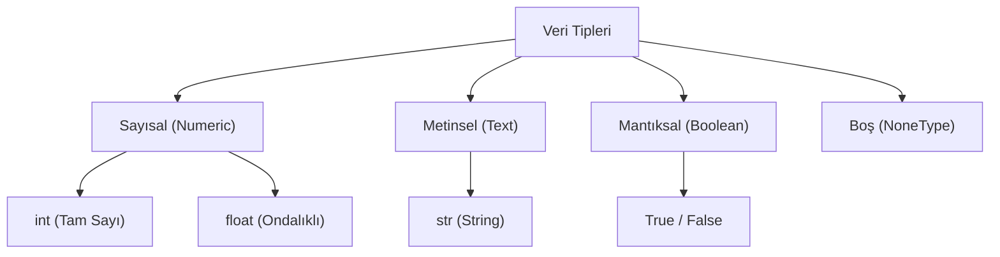

## 📌 Özet
Python'da değişkenler, bilgisayar belleğindeki verilere erişmek için kullandığımız isimlendirilmiş referanslardır. Python 'dinamik tipleme' (dynamic typing) özelliğine sahip olduğundan, bir değişkenin türünü önceden belirtmek gerekmez; değer atandığı anda türü çalışma zamanında belirlenir. Bu esneklik, aynı değişkenin programın ilerleyen safhalarında farklı türden verileri tutabilmesine olanak tanırken, `type()` ve casting (tip dönüşümü) fonksiyonları ile veriler üzerinde tam kontrol sağlar.

## 🧠 Detay



### Değişken Tanımlama
```python
isim = "Ahmet"
yas = 25
pi = 3.14
aktif = True
```

### Temel Veri Tipleri

| Tip | Açıklama | Örnek |
|-----|----------|-------|
| `int` | Tam sayı | `42` |
| `float` | Ondalıklı sayı | `3.14` |
| `str` | Metin | `"merhaba"` |
| `bool` | Mantıksal | `True / False` |
| `NoneType` | Boş değer | `None` |

### Tip Öğrenme ve Dönüştürme
```python
x = 42
print(type(x))       # <class 'int'>

# Tip dönüştürme
sayi = int("10")     # str → int
metin = str(3.14)    # float → str
ondalik = float(5)   # int → float
```

### Çoklu Atama
```python
a, b, c = 1, 2, 3
x = y = z = 0        # hepsi 0
```

### Değişken İsimlendirme Kuralları
- Harf veya `_` ile başlamalı
- Boşluk içeremez
- Büyük/küçük harf duyarlıdır: `isim ≠ Isim`
- `snake_case` kullanımı önerilir: `kullanici_adi`

## 💡 Bağlantılar
- [[Python - Operatörler]]
- [[Python - String İşlemleri]]
- [[Python - Listeler]]

## ❓ Sorular / Anlamadıklarım
- `int` ile `float` arasında hangi durumlarda hangisini kullanmalıyım?
- `None` ile `False` arasındaki fark nedir?

## 🔗 Kaynaklar
- https://docs.python.org/tr/3/library/stdtypes.html
