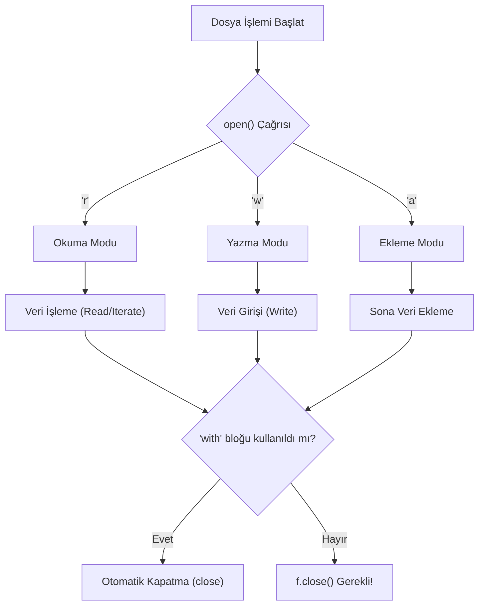

## 📌 Özet
Python'da dosya işlemleri, verilerin kalıcı olarak depolanması ve okunması için `open()` fonksiyonu temel alınarak gerçekleştirilir. Dosya erişiminde en güvenli yöntem, işlem bittiğinde dosyanın otomatik olarak kapatılmasını garanti eden `with` bağlam yöneticisidir (context manager). Farklı erişim modları (`r`, `w`, `a`, `b`) sayesinde metin tabanlı veya ikili (binary) dosyalar üzerinde okuma, yazma ve ekleme işlemleri esnek bir şekilde yürütülebilirken, `os` ve `pathlib` modülleri ile dosya sistemi düzeyinde yönetim sağlanır.

## 🧠 Detay



### Dosya Açma Modları
| Mod | Açıklama |
|-----|----------|
| `r` | Okuma (varsayılan) |
| `w` | Yazma (sıfırdan yazar) |
| `a` | Ekleme (sonuna ekler) |
| `r+` | Okuma + yazma |

### Dosya Okuma
```python
# Tamamını oku
with open("dosya.txt", "r", encoding="utf-8") as f:
    icerik = f.read()

# Satır satır oku
with open("dosya.txt", "r", encoding="utf-8") as f:
    for satir in f:
        print(satir.strip())

# Tüm satırları liste olarak
with open("dosya.txt", "r", encoding="utf-8") as f:
    satirlar = f.readlines()
```

### Dosya Yazma
```python
# Yeni dosya oluştur / üzerine yaz
with open("yeni.txt", "w", encoding="utf-8") as f:
    f.write("Merhaba Dünya\n")
    f.write("İkinci satır\n")

# Sonuna ekle
with open("yeni.txt", "a", encoding="utf-8") as f:
    f.write("Üçüncü satır\n")
```

### os Modülü ile Dosya İşlemleri
```python
import os

print(os.getcwd())              # mevcut dizin
print(os.listdir("."))          # dizin içeriği
os.makedirs("yeni_klasor", exist_ok=True)
os.remove("dosya.txt")         # dosya sil
print(os.path.exists("dosya")) # var mı?
```

## 💡 Bağlantılar
- [[Python - Hata Yönetimi (try-except)]]
- [[Python - JSON İşlemleri]]
- [[Python - Modüller ve Paketler]]

## ❓ Sorular / Anlamadıklarım
- `encoding="utf-8"` neden önemli, ne zaman atlayabilirim?
- Binary dosyalar nasıl okunur?

## 🔗 Kaynaklar
- https://docs.python.org/tr/3/tutorial/inputoutput.html#reading-and-writing-files
