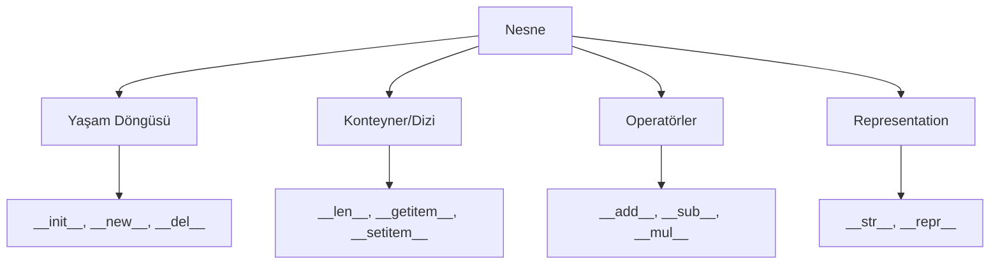

## 📌 Özet
Dunder (Double Underline) veya "Magic" metotlar, Python da nesnelerin dilin yerleşik operatörleri ve fonksiyonları ile nasıl etkileşime gireceğini belirleyen özel metotlardır. Örn: len(), +, [] gibi işlemlerin bir sınıf içinde nasıl davranacağını bu metotlar ile tanımlarız. Python ın "Data Model" yapısının temelini oluştururlar.

## 🧠 Detay



### 1. Yaygın Kullanılan Dunder Metotlar
- __init__: Nesne başlatıldığında çağrılır.
- __str__: print() veya str() çağrıldığında kullanıcı dostu çıktı verir.
- __repr__: Geliştiriciler için nesnenin resmi temsilini döner.
- __len__: len() fonksiyonu çağrıldığında boyutu döner.
- __getitem__: obj[key] şeklinde erişim sağlar.
- __call__: Nesnenin bir fonksiyon gibi obj() şeklinde çağrılmasını sağlar.

### 2. Örnek: Özel Bir Liste Sınıfı
```python
class Canta:
    def __init__(self):
        self.esyalar = []

    def __add__(self, esya):
        self.esyalar.append(esya)
        return self

    def __len__(self):
        return len(self.esyalar)

    def __str__(self):
        return f"Cantada {len(self.esyalar)} esya var: {self.esyalar}"

c = Canta()
c + "Kitap" + "Kalem"
print(c)
print(len(c))
```

### 3. Neden Kullanılır?
- Pythonic Kod: Kendi nesnelerinizin standart Python veri tipleri gibi davranmasını sağlar.
- Esneklik: Operatör aşırı yükleme imkanı tanır.

## 💡 Bağlantılar
- [[Python - OOP - Sınıflar ve Nesneler]]
- [[Python - Context Managers ve with Blokları]]

## ❓ Sorular / Anlamadıklarım
- repr ve str arasındaki temel farklar tam olarak hangi senaryolarda kritik?
- getattr ve getattribute arasındaki fark nedir?

## 🔗 Kaynaklar
- Python Docs: Data Model
- Guide to Pythons Magic Methods
