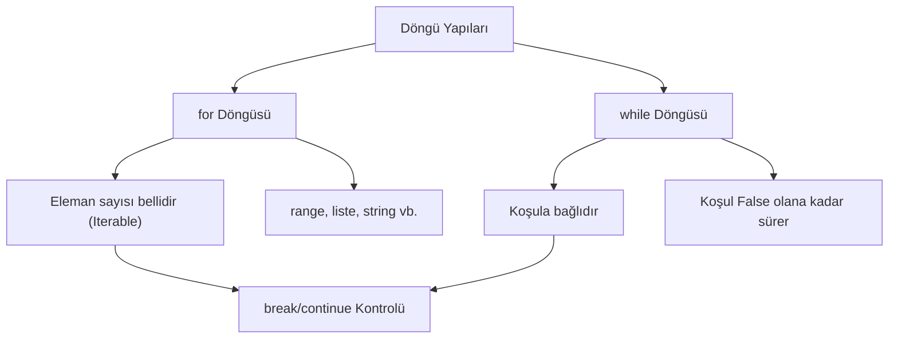

## 📌 Özet
Python'da döngüler, belirli bir kod bloğunun belirli bir koşul altında veya bir veri koleksiyonu üzerinde tekrarlanmasını sağlayan kontrol yapılarıdır. `for` döngüsü genellikle liste, demet veya metin gibi 'yinelenebilir' (iterable) nesneler üzerinde dolaşmak için kullanılırken; `while` döngüsü belirli bir mantıksal koşul doğru olduğu sürece çalışmaya devam eder. Döngü akışını özelleştirmek için `break` (döngüyü kırma), `continue` (mevcut adımı atlama) ve `else` (döngü başarıyla biterse çalışma) gibi yardımcı anahtar kelimeler ile güçlü kontrol mekanizmaları oluşturulabilir.

## 🧠 Detay



### for Döngüsü
```python
# Liste üzerinde
meyveler = ["elma", "muz", "çilek"]
for meyve in meyveler:
    print(meyve)

# range() ile
for i in range(5):        # 0,1,2,3,4
    print(i)

for i in range(2, 10, 2): # 2,4,6,8
    print(i)
```

### while Döngüsü
```python
sayac = 0
while sayac < 5:
    print(sayac)
    sayac += 1

# Sonsuz döngü + break
while True:
    girdi = input("Çıkmak için 'q' gir: ")
    if girdi == "q":
        break
```

### break ve continue
```python
# break → döngüyü tamamen durdurur
for i in range(10):
    if i == 5:
        break
    print(i)  # 0,1,2,3,4

# continue → o adımı atlayıp devam eder
for i in range(10):
    if i % 2 == 0:
        continue
    print(i)  # 1,3,5,7,9
```

### enumerate() ve zip()
```python
# enumerate → index ve değeri birlikte verir
isimler = ["Ali", "Veli", "Ayşe"]
for index, isim in enumerate(isimler):
    print(f"{index}: {isim}")

# zip → iki listeyi eşleştirir
puanlar = [85, 90, 78]
for isim, puan in zip(isimler, puanlar):
    print(f"{isim}: {puan}")
```

### for-else
```python
# else bloğu break olmadan tamamlanırsa çalışır
for i in range(5):
    if i == 10:
        break
else:
    print("Döngü tamamlandı")  # Bu çalışır
```

## 💡 Bağlantılar
- [[Python - Koşullar (if-elif-else)]]
- [[Python - Listeler]]
- [[Python - List & Dict Comprehension]]

## ❓ Sorular / Anlamadıklarım
- `for` mu `while` mu — hangisinde hangisini kullanmalıyım?
- `enumerate` ile `range(len())` arasındaki fark nedir?

## 🔗 Kaynaklar
- https://docs.python.org/tr/3/tutorial/controlflow.html#for-statements
