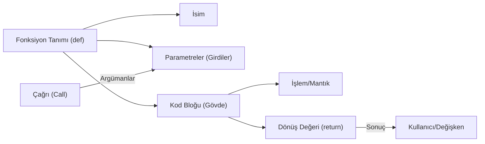

## 📌 Özet
Python'da fonksiyonlar, 'DRY' (Don't Repeat Yourself - Kendini Tekrar Etme) prensibinin temel taşıdır ve belirli bir görevi yerine getirmek üzere tasarlanmış, isimlendirilmiş kod bloklarıdır. `def` anahtar kelimesiyle tanımlanan bu yapılar, modüler programlama anlayışıyla karmaşık problemleri daha küçük ve yönetilebilir parçalara ayırmamızı sağlar. Fonksiyonlar; parametreler aracılığıyla girdi alabilir, `return` ile çıktı üretebilir ve `*args`/`**kwargs` gibi esnek yapılarla değişken sayıda veri üzerinde işlem yaparak kodun yeniden kullanılabilirliğini maksimuma çıkarır.

## 🧠 Detay



### 1. Fonksiyon Tanımlama ve Çağırma
Python'da bir fonksiyon `def` anahtar kelimesi ile tanımlanır:

```python
def selamla():
    print("Merhaba, Python Dünyası!")

# Fonksiyonu çağırma
selamla()
```

### 2. Parametre ve Argüman Kullanımı
Fonksiyonlar dışarıdan veri alabilirler:

```python
def kisi_selamla(isim):
    print(f"Merhaba {isim}!")

kisi_selamla("Ahmet")
```

#### Varsayılan Parametre Değerleri
Eğer fonksiyona bir argüman gönderilmezse varsayılan bir değer kullanabilir:

```python
def selamla(isim="Ziyaretçi"):
    print(f"Merhaba {isim}!")

selamla()        # Çıktı: Merhaba Ziyaretçi!
selamla("Can")   # Çıktı: Merhaba Can!
```

### 3. Değer Döndürme (`return`)
Bir fonksiyonun işlem sonucunu çağıran yere geri göndermesi için `return` ifadesi kullanılır:

```python
def topla(a, b):
    return a + b

sonuc = topla(5, 3)
print(sonuc) # Çıktı: 8
```

### 4. Esnek Parametreler (`*args` ve `**kwargs`)
- **`*args`**: Fonksiyona değişken sayıda isimsiz argüman göndermek için kullanılır (Demet/Tuple olarak alınır).
- **`**kwargs`**: Fonksiyona değişken sayıda isimli (keyword) argüman göndermek için kullanılır (Sözlük/Dictionary olarak alınır).

```python
def sayilari_topla(*sayilar):
    return sum(sayilar)

print(sayilari_topla(1, 2, 3, 4, 5)) # Çıktı: 15

def bilgileri_goster(**bilgiler):
    for anahtar, deger in bilgiler.items():
        print(f"{anahtar}: {deger}")

bilgileri_goster(ad="Elif", soyad="Yılmaz", sehir="Ankara")
```

### 5. Lambda (Anonim) Fonksiyonlar
Tek satırlık kısa fonksiyonlar tanımlamak için kullanılır:

```python
kare_al = lambda x: x ** 2
print(kare_al(5)) # Çıktı: 25
```

## 💡 Bağlantılar
- [[Python - Temel Veri Tipleri]]
- [[Python - Kontrol Yapıları]]

## ❓ Sorular / Anlamadıklarım
- Python'da `scope` (kapsam) kuralları (local vs global) fonksiyonlar içinde nasıl çalışır?
- `*args` ve `**kwargs` aynı fonksiyonda birlikte nasıl kullanılır?

## 🔗 Kaynaklar
- [Python Official Documentation - Defining Functions](https://docs.python.org/3/tutorial/controlflow.html#defining-functions)
- [W3Schools Python Functions](https://www.w3schools.com/python/python_functions.asp)