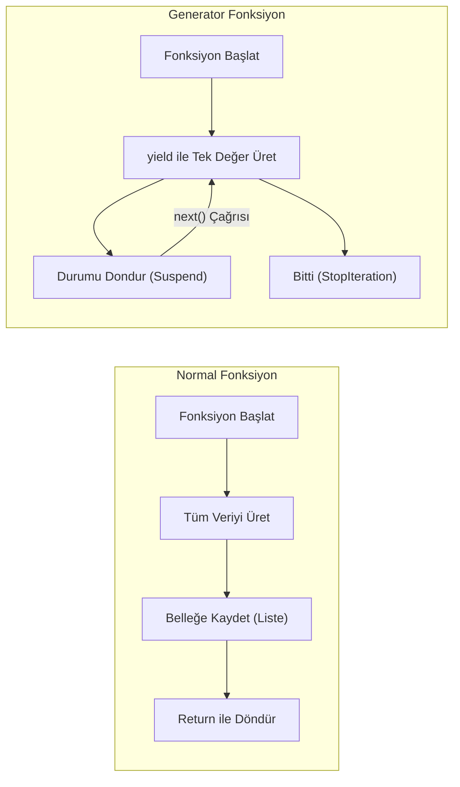

## 📌 Özet
Generator'lar (Üreteçler), Python'da bellek verimliliğini maksimize eden özel fonksiyonlardır. Klasik fonksiyonlar tüm sonucu bir kerede (`return`) belleğe yükleyip dönerken, generator'lar `yield` ifadesini kullanarak değerleri talep edildikçe (lazy evaluation) üretirler. Bu yöntem, özellikle milyonlarca satırlık büyük dosyaların okunması veya sonsuz sayı dizilerinin oluşturulması gibi senaryolarda belleği şişirmeden verimli veri işleme imkanı sağlar. Bir generator nesnesi bir kez tüketildikten sonra tekrar kullanılamaz, bu da onu 'tek yönlü' bir veri akışı haline getirir.

## 🧠 Detay



### Generator Fonksiyon
```python
def sayac(n):
    i = 0
    while i < n:
        yield i      # değeri üret, dur ve bekle
        i += 1

gen = sayac(5)
print(next(gen))  # 0
print(next(gen))  # 1

for sayi in sayac(5):
    print(sayi)   # 0,1,2,3,4
```

### Generator vs Liste
```python
import sys

# Liste → tüm veri bellekte
liste = [x**2 for x in range(10000)]
print(sys.getsizeof(liste))   # ~87624 byte

# Generator → sadece bir değer bellekte
gen = (x**2 for x in range(10000))
print(sys.getsizeof(gen))     # ~112 byte
```

### Sonsuz Generator
```python
def sonsuz_sayac(baslangic=0):
    n = baslangic
    while True:
        yield n
        n += 1

gen = sonsuz_sayac()
print(next(gen))   # 0
print(next(gen))   # 1
# Sonsuza gider
```

### yield from
```python
def zincir(*iterables):
    for it in iterables:
        yield from it

for x in zincir([1,2], [3,4], [5,6]):
    print(x)   # 1,2,3,4,5,6
```

### Pratik Kullanım: Büyük Dosya Okuma
```python
def satir_oku(dosya_yolu):
    with open(dosya_yolu, "r") as f:
        for satir in f:
            yield satir.strip()

for satir in satir_oku("buyuk_dosya.txt"):
    print(satir)
```

## 💡 Bağlantılar
- [[Python - Fonksiyonlar]]
- [[Python - List & Dict Comprehension]]
- [[Python - Dosya İşlemleri]]

## ❓ Sorular / Anlamadıklarım
- `return` ile `yield` arasındaki temel fark nedir?
- Generator'ı ne zaman liste yerine kullanmalıyım?

## 🔗 Kaynaklar
- https://docs.python.org/tr/3/howto/functional.html#generators
