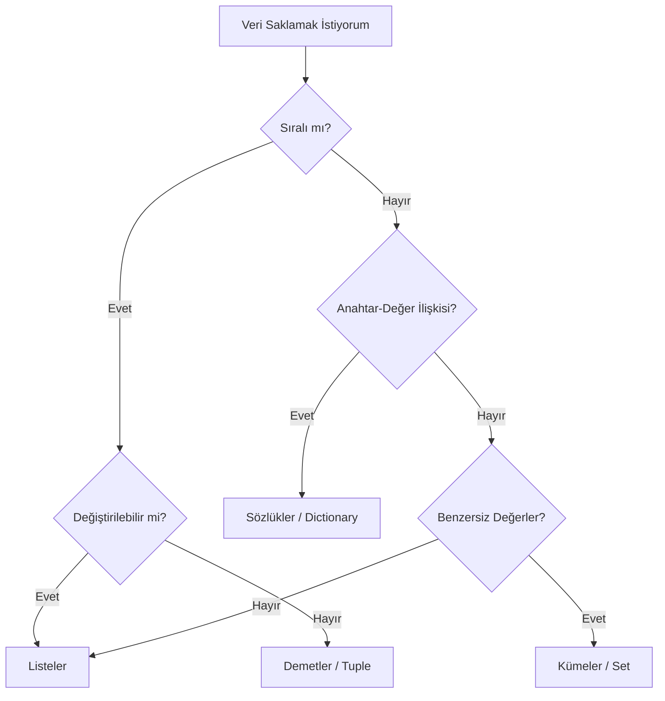

## 📌 Özet
Python, okunabilirliği yüksek, çok amaçlı ve geniş kütüphane desteğine sahip bir programlama dilidir. Veri bilimi, web geliştirme ve otomasyon alanlarında dünya standartıdır.

---

## 🧠 Detay

### 🗺️ Python Veri Yapısı Seçim Rehberi

### Python Öğrenme Yol Haritası

1. **Temeller:** Değişkenler, Operatörler, Veri Tipleri.
2. **Kontrol Yapıları:** Koşullar (if), Döngüler (for, while).
3. **Fonksiyonel Programlama:** Fonksiyonlar, Lambda, Scope.
4. **Veri Yapıları:** List, Dict, Set, Tuple, Comprehensions.
5. **Dosya ve Hata Yönetimi:** try-except, open(), JSON.
6. **OOP (Nesne Yönelimli Programlama):** Sınıflar, Kalıtım, Kapsülleme.
7. **İleri Seviye:** Decorators, Generators, Iterators.
8. **Ekosistem:** pip, venv, Modüller ve Paketler.

---

## 💡 Bağlantılar
- [[Python - Değişkenler ve Veri Tipleri]]
- [[Python - Listeler]]
- [[Python - Sınıflar ve Nesneler]]

## ❓ Sorular / Anlamadıklarım
- Python neden "interpret" edilen bir dildir?
- GIL (Global Interpreter Lock) nedir ve performansı nasıl etkiler?

## 🔗 Kaynaklar
- https://docs.python.org/3/tutorial/index.html
