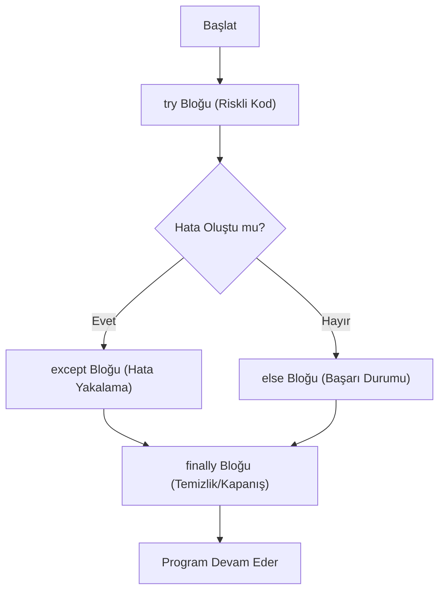

## 📌 Özet
Python'da Hata Yönetimi, programın yürütülmesi sırasında karşılaşılan beklenmedik durumların (istisnalar/exceptions) programı tamamen durdurmasını önlemek ve bu durumları kontrollü bir şekilde yönetmek için kullanılır. `try` bloğu riskli kodu içerirken, `except` blokları spesifik hata türlerini yakalayarak çözüm üretir. Hata oluşmadığında çalışan `else` ve her koşulda kaynakları serbest bırakmak (dosya kapatmak vb.) için kullanılan `finally` blokları sayesinde, dayanıklı (robust) ve kullanıcı dostu uygulamalar geliştirilir.

## 🧠 Detay



### Temel try-except
```python
try:
    sayi = int(input("Sayı gir: "))
    print(10 / sayi)
except ValueError:
    print("Geçersiz giriş!")
except ZeroDivisionError:
    print("Sıfıra bölme hatası!")
```

### else ve finally
```python
try:
    dosya = open("veri.txt", "r")
    icerik = dosya.read()
except FileNotFoundError:
    print("Dosya bulunamadı")
else:
    print("Dosya başarıyla okundu")  # hata yoksa çalışır
finally:
    print("Her zaman çalışır")       # hata olsa da olmasa da
```

### Tüm Hataları Yakalama
```python
try:
    # riskli kod
    pass
except Exception as e:
    print(f"Hata: {e}")
    print(type(e).__name__)
```

### Özel Hata Fırlatma
```python
def yas_kontrol(yas):
    if yas < 0:
        raise ValueError("Yaş negatif olamaz!")
    return yas

try:
    yas_kontrol(-5)
except ValueError as e:
    print(e)
```

### Özel Exception Sınıfı
```python
class YasHatasi(Exception):
    def __init__(self, mesaj):
        super().__init__(mesaj)

raise YasHatasi("Geçersiz yaş değeri")
```

### Yaygın Hata Tipleri
| Hata | Neden |
|------|-------|
| `ValueError` | Yanlış değer |
| `TypeError` | Yanlış tip |
| `KeyError` | Sözlükte yok |
| `IndexError` | İndex aşımı |
| `FileNotFoundError` | Dosya yok |
| `ZeroDivisionError` | Sıfıra bölme |

## 💡 Bağlantılar
- [[Python - Fonksiyonlar]]
- [[Python - Dosya İşlemleri]]
- [[Python - OOP - Sınıflar ve Nesneler]]

## ❓ Sorular / Anlamadıklarım
- `except Exception` ile `except BaseException` farkı nedir?
- Hataları ne zaman yakalayıp ne zaman fırlatmalıyım?

## 🔗 Kaynaklar
- https://docs.python.org/tr/3/tutorial/errors.html
