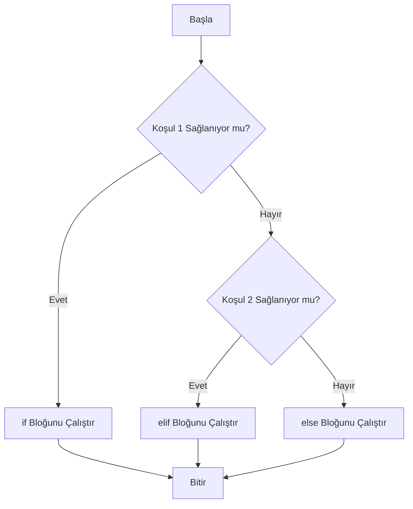

## 📌 Özet
Python'da koşullu ifadeler, program akışını belirli mantıksal şartlara göre yönlendirmek için kullanılan temel yapı taşlarıdır. `if` bloğu bir koşulun doğruluğunu kontrol ederken, `elif` (else if) birden fazla alternatif senaryoyu test etmemize olanak tanır ve `else` bloğu ise hiçbir koşul sağlanmadığında devreye giren varsayılan yoldur. Python'ın girinti (indentation) temelli yapısı sayesinde bu bloklar hem okunabilirliği artırır hem de karmaşık karar ağaçlarının oluşturulmasını sağlar. Ayrıca, tek satırlık ternary operatörler ve Python 3.10 ile gelen `match-case` yapısı gibi alternatifler de akış kontrolünü daha esnek hale getirir.

## 🧠 Detay



### Temel if-elif-else
```python
yas = 20

if yas < 18:
    print("Çocuk")
elif yas < 65:
    print("Yetişkin")
else:
    print("Yaşlı")
```

### İç İçe Koşullar
```python
puan = 75

if puan >= 50:
    if puan >= 85:
        print("Pekiyi")
    elif puan >= 70:
        print("İyi")
    else:
        print("Geçti")
else:
    print("Kaldı")
```

### Tek Satır (Ternary)
```python
x = 10
sonuc = "pozitif" if x > 0 else "negatif"
print(sonuc)  # pozitif
```

### Mantıksal Operatörlerle Koşul
```python
yas = 25
vatandas = True

if yas >= 18 and vatandas:
    print("Oy kullanabilir")

sehir = "İstanbul"
if sehir == "İstanbul" or sehir == "Ankara":
    print("Büyükşehir")
```

### Truthy / Falsy Değerler
```python
# False sayılanlar: 0, "", [], {}, None, False
# True sayılanlar: diğer her şey

liste = []
if liste:
    print("Dolu")
else:
    print("Boş")  # Bu çalışır
```

## 💡 Bağlantılar
- [[Python - Operatörler]]
- [[Python - Döngüler (for-while)]]
- [[Python - Fonksiyonlar]]

## ❓ Sorular / Anlamadıklarım
- `match-case` (Python 3.10+) ile `if-elif` arasında ne fark var?
- Truthy/Falsy değerleri nerede dikkat etmeliyim?

## 🔗 Kaynaklar
- https://docs.python.org/tr/3/tutorial/controlflow.html
