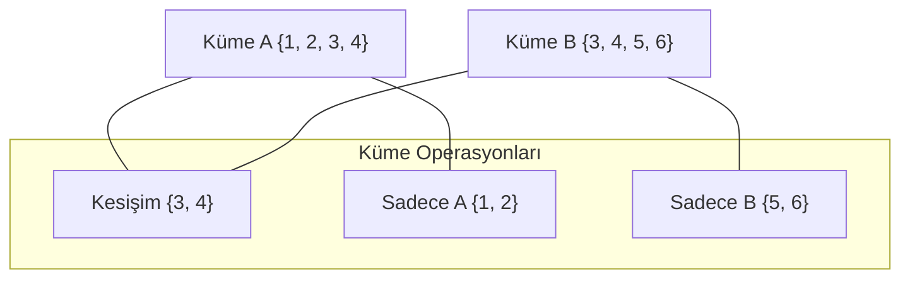

## 📌 Özet
Python'da kümeler (set), her bir elemanın yalnızca bir kez yer alabildiği, sırasız ve indekslenemeyen koleksiyonlardır. Kümeler, özellikle veri setlerindeki mükerrer kayıtları temizlemek, hızlı üyelik sorgulamaları (membership testing) yapmak ve matematiksel küme operasyonlarını (birleşim, kesişim, fark) gerçekleştirmek için optimize edilmiştir. Listelerin aksine, kümeler hash tabanlı bir yapı kullandığı için milyonlarca eleman içinde bir değerin varlığını kontrol etmek neredeyse anlık (O(1) zaman karmaşıklığı) gerçekleşir. Değiştirilebilir bir yapıda olmalarına rağmen, küme elemanlarının kendileri "hashable" (değişmez) olmalıdır; yani bir küme içinde liste veya başka bir küme barındıramaz (ancak `frozenset` kullanılabilir).

## 🧠 Detay



### Küme Oluşturma
```python
sayilar = {1, 2, 3, 4, 5}
tekrarli = {1, 2, 2, 3, 3}  # → {1, 2, 3}
bos = set()                  # {} değil! (o sözlük)
```

### Eleman Ekleme ve Silme
```python
s = {1, 2, 3}
s.add(4)          # {1, 2, 3, 4}
s.remove(2)       # {1, 3, 4} → yoksa hata verir
s.discard(99)     # yoksa hata vermez
s.pop()           # rastgele siler
```

### Küme İşlemleri
```python
a = {1, 2, 3, 4}
b = {3, 4, 5, 6}

print(a | b)   # Birleşim:  {1,2,3,4,5,6}
print(a & b)   # Kesişim:   {3,4}
print(a - b)   # Fark:      {1,2}
print(a ^ b)   # Simetrik:  {1,2,5,6}
```

### Üyelik Kontrolü
```python
s = {1, 2, 3}
print(2 in s)   # True  → listeden çok daha hızlı!
print(5 in s)   # False
```

### Pratik Kullanım: Tekrar Silme
```python
liste = [1, 2, 2, 3, 4, 4, 5]
benzersiz = list(set(liste))
print(benzersiz)  # [1, 2, 3, 4, 5]
```

## 💡 Bağlantılar
- [[Python - Listeler]]
- [[Python - Sözlükler (Dictionary)]]
- [[Python - Döngüler (for-while)]]

## ❓ Sorular / Anlamadıklarım
- `frozenset` nedir, ne zaman kullanılır?
- Büyük verilerde `in` kontrolü için list mi set mi kullanmalıyım?

## 🔗 Kaynaklar
- https://docs.python.org/tr/3/tutorial/datastructures.html#sets
