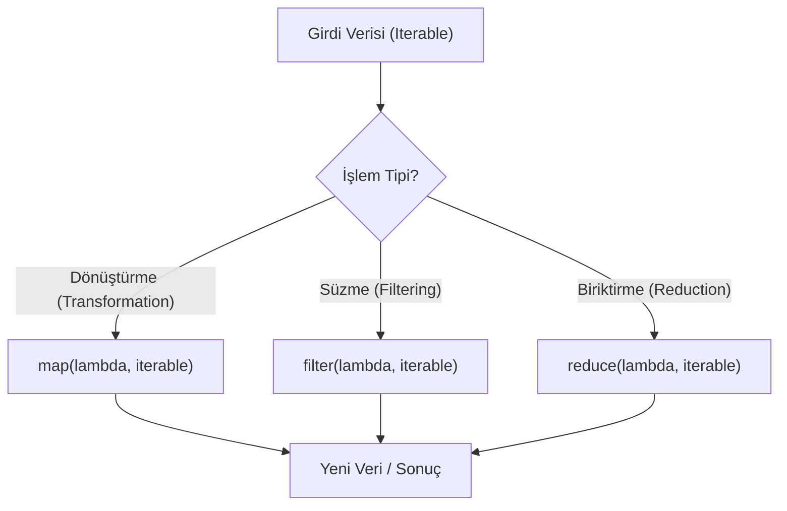

## 📌 Özet
Python'da Lambda ifadeleri, isim verilmeden tanımlanan ve genellikle kısa süreli işlemler için kullanılan "anonim" fonksiyonlardır. Fonksiyonel programlama paradigmasının temel araçları olan `map()`, `filter()` ve `reduce()` gibi yüksek seviyeli fonksiyonlarla (higher-order functions) birlikte kullanıldıklarında, kodun daha kompakt ve deklaratif bir yapıda olmasını sağlarlar. Özellikle veri işleme boru hatlarında (data pipelines) ve karmaşık listeleri belirli kriterlere göre sıralarken (custom sorting) lambda fonksiyonları büyük kolaylık sunar. Ancak, çok karmaşık mantıklar için lambda yerine standart `def` bloklarını kullanmak, kodun okunabilirliğini ve sürdürülebilirliğini korumak açısından daha doğru bir yaklaşımdır.

## 🧠 Detay



### Lambda
```python
# Normal fonksiyon
def kare(x):
    return x**2

# Lambda karşılığı
kare = lambda x: x**2
print(kare(5))   # 25

# Çok parametreli
topla = lambda a, b: a + b
print(topla(3, 4))   # 7
```

### map()
```python
# Her elemana fonksiyon uygular
sayilar = [1, 2, 3, 4, 5]

kareler = list(map(lambda x: x**2, sayilar))
# [1, 4, 9, 16, 25]

# Birden fazla liste
toplam = list(map(lambda a,b: a+b, [1,2,3], [4,5,6]))
# [5, 7, 9]
```

### filter()
```python
# Koşulu sağlayanları filtreler
sayilar = [1, 2, 3, 4, 5, 6, 7, 8]

ciftler = list(filter(lambda x: x % 2 == 0, sayilar))
# [2, 4, 6, 8]
```

### sorted() ile Lambda
```python
kisiler = [
    {"isim": "Ali", "yas": 30},
    {"isim": "Ayşe", "yas": 25},
    {"isim": "Veli", "yas": 35}
]

# Yaşa göre sırala
sirali = sorted(kisiler, key=lambda k: k["yas"])
```

### functools.reduce()
```python
from functools import reduce

sayilar = [1, 2, 3, 4, 5]
carpim = reduce(lambda a, b: a * b, sayilar)
# 120
```

### Lambda vs Comprehension
```python
# Lambda + map
kareler = list(map(lambda x: x**2, range(10)))

# Comprehension (daha okunabilir)
kareler = [x**2 for x in range(10)]
```

## 💡 Bağlantılar
- [[Python - Fonksiyonlar]]
- [[Python - List & Dict Comprehension]]
- [[Python - Decorators]]

## ❓ Sorular / Anlamadıklarım
- Lambda'yı ne zaman, comprehension'ı ne zaman kullanmalıyım?
- `reduce()` yerine ne kullanılabilir?

## 🔗 Kaynaklar
- https://docs.python.org/tr/3/howto/functional.html
