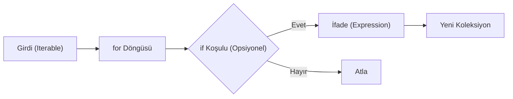

## 📌 Özet
Python'da Comprehension yapıları, mevcut koleksiyonlardan yeni liste, sözlük veya küme oluşturmak için kullanılan son derece güçlü, özlü ve Pythonik bir yöntemdir. Standart `for` döngülerine kıyasla hem daha az satır kod yazılmasını sağlar hem de Python yorumlayıcısı tarafından C seviyesinde optimize edildiği için genellikle daha performanslı çalışır. Temel olarak bir ifade, bir döngü ve isteğe bağlı bir koşul (if) bloğundan oluşan bu yapılar, veri dönüşümü ve filtreleme işlemlerini tek bir satıra indirger. Ancak, kodun okunabilirliğini korumak adına, iç içe geçmiş (nested) çok sayıda döngü barındıran karmaşık işlemler için standart döngü yapılarının tercih edilmesi daha sağlıklı bir yaklaşımdır.

## 🧠 Detay



### List Comprehension
```python
# Temel yapı: [ifade for eleman in iterable if koşul]

# Kareleri al
kareler = [x**2 for x in range(10)]

# Çift sayıları filtrele
ciftler = [x for x in range(20) if x % 2 == 0]

# String dönüşümü
kelimeler = ["merhaba", "dünya"]
buyuk = [k.upper() for k in kelimeler]

# İç içe döngü
matris = [[i*j for j in range(1,4)] for i in range(1,4)]
```

### Dict Comprehension
```python
# {anahtar: değer for eleman in iterable}

kareler = {x: x**2 for x in range(5)}
# {0:0, 1:1, 2:4, 3:9, 4:16}

# Filtreyle
cift_kareler = {x: x**2 for x in range(10) if x % 2 == 0}

# Listeyi dict'e çevir
isimler = ["Ali", "Veli", "Ayşe"]
uzunluklar = {isim: len(isim) for isim in isimler}
```

### Set Comprehension
```python
benzersiz_kareler = {x**2 for x in [-2,-1,0,1,2]}
# {0, 1, 4}
```

### Generator Expression
```python
# () ile → bellekte yer kaplamaz
toplam = sum(x**2 for x in range(1000))
```

### Comprehension vs for Döngüsü
```python
# Uzun yol
kareler = []
for x in range(10):
    kareler.append(x**2)

# Kısa yol (comprehension)
kareler = [x**2 for x in range(10)]
```

## 💡 Bağlantılar
- [[Python - Listeler]]
- [[Python - Sözlükler (Dictionary)]]
- [[Python - Döngüler (for-while)]]
- [[Python - Generators]]

## ❓ Sorular / Anlamadıklarım
- Çok karmaşık comprehension okunabilirliği düşürür mü?
- Generator expression ne zaman list comprehension'dan daha iyi?

## 🔗 Kaynaklar
- https://docs.python.org/tr/3/tutorial/datastructures.html#list-comprehensions
