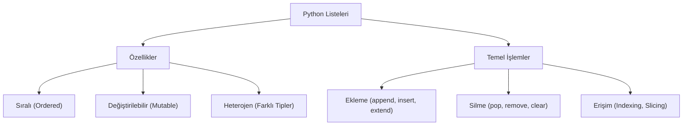

## 📌 Özet
Python'da listeler, birden fazla öğeyi tek bir değişken altında saklamamıza olanak tanıyan, sıralı ve değiştirilebilir (mutable) veri yapılarının temelini oluşturur. Farklı veri türlerini (int, str, float, bool ve hatta diğer listeleri) bir arada barındırabilen bu yapılar, `[]` parantezleri ile tanımlanır ve elemanlarına sıfır tabanlı indeksleme sistemiyle erişilir. Listeler üzerinde dinamik olarak eleman ekleme, silme, güncelleme ve dilimleme (slicing) işlemleri kolaylıkla gerçekleştirilebilir. Programlama süreçlerinde veri kümelerini yönetmek, döngülerle üzerinde işlem yapmak ve karmaşık veri organizasyonları kurmak için en sık başvurulan araçlardan biridir.

## 🧠 Detay



Python'da listeler, farklı veri tiplerini (sayılar, metinler, hatta başka listeler) bir arada tutabilen son derece esnek yapılardır.

### 1. Liste Oluşturma
Boş bir liste veya başlangıç elemanları olan bir liste tanımlayabilirsiniz:

```python
# Boş liste oluşturma
bos_liste = []
bos_liste_alternatif = list()

# Elemanlı liste oluşturma
sayilar = [1, 2, 3, 4, 5]
meyveler = ["elma", "muz", "çilek"]

# Farklı veri tiplerini bir arada tutan liste
karisik = [1, "merhaba", 3.14, True]
```

### 2. İndexleme (Indexing)
Listeler sıralı yapılardır ve her elemanın 0'dan başlayan bir indeksi vardır. Negatif indeksleme ile sondan başlanarak da erişim sağlanabilir:

```python
meyveler = ["elma", "muz", "çilek"]

print(meyveler[0])   # Çıktı: 'elma' (ilk eleman)
print(meyveler[-1])  # Çıktı: 'çilek' (son eleman)
print(meyveler[-2])  # Çıktı: 'muz' (sondan ikinci eleman)
```

### 3. Dilimleme (Slicing)
Listenin belirli bir alt kümesini almak için `liste[başlangıç:bitiş:adım]` formülü kullanılır (bitiş indeksi dahil değildir):

```python
sayilar = [0, 1, 2, 3, 4, 5]

print(sayilar[:3])    # Çıktı: [0, 1, 2] (ilk 3 eleman)
print(sayilar[2:5])   # Çıktı: [2, 3, 4] (2, 3 ve 4. indeksler)
print(sayilar[::2])   # Çıktı: [0, 2, 4] (ikişer ikişer atlayarak)
print(sayilar[::-1])  # Çıktı: [5, 4, 3, 2, 1, 0] (listeyi ters çevirir)
```

### 4. Eleman Ekleme ve Silme Metotları
Listeler değiştirilebilir (mutable) olduğu için üzerinde ekleme ve silme işlemleri kolayca yapılabilir:

```python
liste = ["elma", "muz"]

# append(): Listenin sonuna eleman ekler
liste.append("kiraz")   # ['elma', 'muz', 'kiraz']

# insert(): Belirtilen indekse eleman yerleştirir
liste.insert(1, "portakal") # ['elma', 'portakal', 'muz', 'kiraz']

# remove(): Belirtilen değere sahip ilk elemanı siler
liste.remove("muz")     # ['elma', 'portakal', 'kiraz']

# pop(): Belirtilen indeksteki elemanı siler ve döndürür (varsayılan son eleman)
son_meyve = liste.pop() # 'kiraz' silinir, liste: ['elma', 'portakal']
```

### 5. List Comprehension (Liste Anlayışı)
Python'da tek bir satırda döngüler ve koşullar kullanarak hızlıca listeler oluşturmayı sağlar:

```python
# 0'dan 4'e kadar olan sayıların kareleri
kareler = [x**2 for x in range(5)]         # Çıktı: [0, 1, 4, 9, 16]

# 0'dan 9'a kadar olan çift sayılar
ciftler = [x for x in range(10) if x % 2 == 0] # Çıktı: [0, 2, 4, 6, 8]
```

## 💡 Bağlantılar
- [[Python - Döngüler]]
- [[Python - Sözlükler]]
- [[Python - Demetler]]
- [[Python - Veri Yapıları]]

## ❓ Sorular / Anlamadıklarım
- `append()` ile `insert()` arasındaki performans farkı nedir?
- List comprehension ne zaman normal `for` döngüsünden daha avantajlıdır?

## 🔗 Kaynaklar
- [Python Official Documentation - Data Structures](https://docs.python.org/3/tutorial/datastructures.html)
