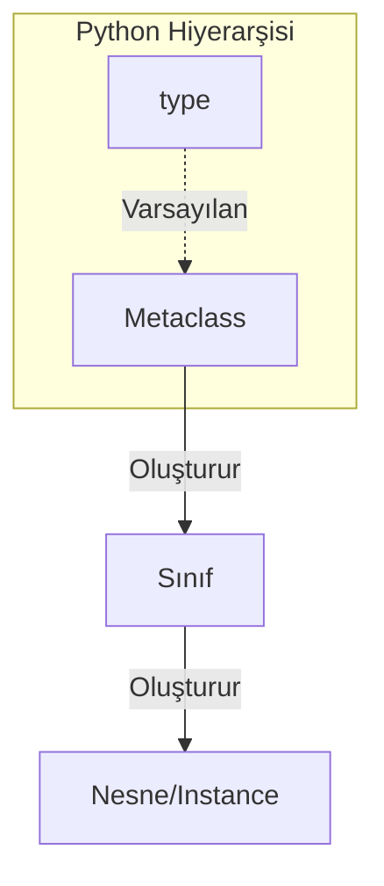

## 📌 Özet
Metaprogramlama, kod yazan kod yazmak olarak tanımlanabilir. Python da Metaclass lar, sınıfların nasıl oluşturulacağını belirleyen sınıflardır. Normalde bir nesne bir sınıfın örneğiyse, bir sınıf da bir metaclass ın örneğidir. Python da varsayılan metaclass "type" dır.

## 🧠 Detay



### 1. Metaclass Nedir?
Python da her şey bir nesnedir, sınıflar dahil. Bir sınıfı tanımladığınızda, Python arka planda o sınıfı oluşturmak için bir metaclass kullanır.
- Nesneyi oluşturan: `__init__`
- Sınıfı oluşturan: Metaclass ın `__new__` ve `__init__` metotları.

### 2. Özel Metaclass Oluşturma
Metaclass lar `type` sınıfından türetilir.

```python
class KucukHarfMetaclass(type):
    def __new__(cls, name, bases, dct):
        # Tüm öznitelikleri küçük harfe çevir
        lower_dct = {k.lower(): v for k, v in dct.items() if not k.startswith("__")}
        return super().__new__(cls, name, bases, lower_dct)

class Test(metaclass=KucukHarfMetaclass):
    VAR = 10
    def MESAJ(self):
        print("Merhaba")

t = Test()
# t.VAR hata verir, t.var çalışır
```

### 3. Kullanım Alanları
- API veya Framework geliştirme (Django ORM gibi).
- Sınıf tanımlandığında otomatik kayıt (registration) yapma.
- Sınıf özniteliklerini zorunlu kılma veya kontrol etme.

## 💡 Bağlantılar
- [[Python - OOP - Sınıflar ve Nesneler]]
- [[Python - Dunder (Magic) Metotlar]]

## ❓ Sorular / Anlamadıklarım
- Metaclass lar yerine "Class Decorators" ne zaman tercih edilmeli?
- Metaclass kullanımı kodun okunabilirliğini nasıl etkiler?

## 🔗 Kaynaklar
- Python Docs: Metaclasses
- Real Python: Python Metaclasses
