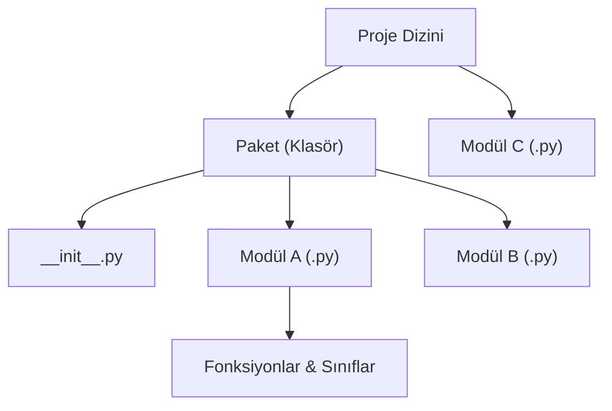

## 📌 Özet
Python'da modüller ve paketler, kodun modülerliğini artırmak ve büyük projeleri daha yönetilebilir parçalara bölmek için kullanılan hiyerarşik yapılardır. Bir modül, içinde fonksiyonlar, sınıflar ve değişkenler barındıran basit bir `.py` dosyasıyken; paketler, içinde birden fazla modül ve genellikle bir `__init__.py` dosyası bulunduran klasör dizinleridir. Bu yapılar sayesinde kodun tekrar kullanımı (reusability) sağlanır, isim çakışmaları (namespace pollution) önlenir ve standart kütüphanedeki zengin araç seti ile dış kaynaklı kütüphaneler projeye kolayca dahil edilebilir. `import` mekanizması, Python'ın esnekliğini sağlayan en temel özelliklerden biridir ve hem yerel dosyaları hem de yüklü kütüphaneleri aynı tutarlılıkla yönetmemize imkan tanır.

## 🧠 Detay



### Modül İçe Aktarma
```python
import math
print(math.sqrt(16))     # 4.0
print(math.pi)           # 3.14159...

# Belirli fonksiyonu al
from math import sqrt, pi
print(sqrt(25))

# Takma ad ver
import numpy as np
import pandas as pd
```

### Yerleşik Modüller
```python
import random
print(random.randint(1, 100))    # rastgele sayı
print(random.choice(["a","b"]))  # rastgele seçim

import datetime
bugun = datetime.date.today()
print(bugun)

import os
print(os.getcwd())

import sys
print(sys.version)
```

### Kendi Modülünü Oluşturma
```python
# hesapla.py dosyası
def topla(a, b):
    return a + b

def carp(a, b):
    return a * b

# main.py dosyasında kullan
import hesapla
print(hesapla.topla(3, 5))
```

### `__name__` Kullanımı
```python
# modül.py
def fonksiyon():
    print("Çalıştı")

if __name__ == "__main__":
    # sadece direkt çalıştırılınca burası çalışır
    fonksiyon()
```

### Paket Yapısı
```
proje/
  __init__.py
  matematik/
    __init__.py
    temel.py
    gelismis.py
  utils/
    __init__.py
    yardimci.py
```

## 💡 Bağlantılar
- [[Python - pip ve Paket Yönetimi]]
- [[Python - Virtual Environment]]
- [[Python - Dosya İşlemleri]]

## ❓ Sorular / Anlamadıklarım
- `__init__.py` dosyasının içine ne yazılır?
- Circular import hatası neden olur, nasıl çözülür?

## 🔗 Kaynaklar
- https://docs.python.org/tr/3/tutorial/modules.html
